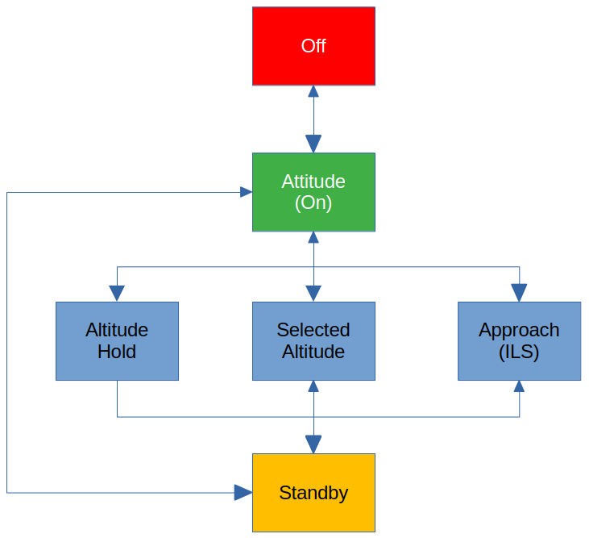

.. _link_chapter_autopilot:

********************
The Autopilot system
********************

The Mirage has a rather simple (but not simplistic) autopilot, which can be either ``off``, ``on`` in a specific mode or in ``standby``. The following modes are available:

* Attitude hold (``PA`` - basic mode): keep the pitch and roll attitude of the aircraft as maintained or indicated
* Altitude hold (``ALT`` - advanced mode): maintain the altitude as captured at the moment when the ``ALT`` button was pressed.
* Selected altitude hold (``ALT AFF`` - advanced mode): capture and then maintain the altitude as pre-selected in :ref:`link_subsection_cfg_page`.
* (mode not in use)
* Automatic approach (``LG`` - advanced mode): capture / maintain heading and pitch based ILS signal as well as pre-selected runway heading (*CP - cap vrai piste*) and glideslope (*PD – pente désirée*)

Please be aware:

* There is no autopilot mode for speed. In all modes the pilot has to actively use the throttle to maintain the desired speed.
* There is no autopilot mode to follow waypoints.
* The *autpilot* and *terrain following* are not the same thing. And currently terrain following is not implemented.
* The default FlightGear autopilot and autompilot dialogue are not available.

To change modes do the following:

* To engage or disengage the autopilot press either the ``PA`` button or use ``Key: BACKSPACE``. If the autopilot is in one of the three advanced modes, then you have to toggle twice to disengage (once to get from an advanced mode to the basic mode and then to disengage altogether).
* To engage or disengage standby mode use ``Key: ctrl + a`` (there is no button on the panel). Does only work if the autopilot is in a basic or advanced mode.
* To engage one of the three advanced modes (``ALT``, ``ALT AFF``, ``LG``) press the respecitive buttons on the panel (there is no key binding). To disengage one of the three advanced modes either choose a different advanced mode or press the ``PA`` button to get into basic mode.

The following features of the original autopilot are not yet implemented:

* Moving the stick more than 50% will not disengage the autopilot.
* The autopilot does not wait to be fully engaged until the stick is in the neutral position.
* When the autopilot is engaged, you cannot use the trim buttons to change pitch attitude and bearing.
* Some specific yellow buttons will not blink in specific situations - instead they will illuminate steadily.
