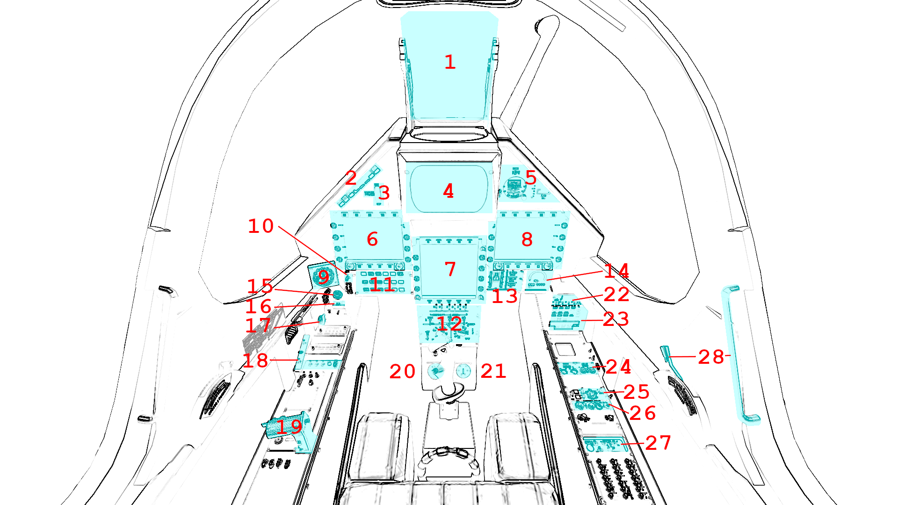

*******************
Cockpit instruments
*******************

Overview
========

#. `Head-up display (HUD)⇗ <https://en.wikipedia.org/wiki/Head-up_display>`_ - French: `visualisation tête haute (VTH)⇗ <https://fr.wikipedia.org/wiki/Affichage_t%C3%AAte_haute>`_
#. Autopilot panel
#. Elevator trim
#. Head-level display - French: visualisation tête moyenne (VTM)
#. Physical flight instruments
#. Left `Multi-function display (MFD)⇗ <https://en.wikipedia.org/wiki/Multi-function_display>`_ - French: écran multifonction
#. Head-down display - French: visualisation tête basse (VTB)
#. Right MFD
#. Clock (UTC)
#. Master Arm switch
#. Weapons indicator
#. Transponder
#. Fuel indicator panel
#. Engine indicator panel
#. External tank jettison button
#. Gear indicator
#. Gear lever
#. Light switches
#. Throttle stick
#. Elevon angle indicator
#. Altimeter
#. Power switches
#. Alert panel
#. ILS & TACAN panel
#. Air conditioning panel
#. Interior lighting
#. Engine panel
#. Canopy handle & lock

1. HUD
======

[Placeholder]

2. Autopilot panel
==================

The autopilot allows the onboard computer to control the aircraft without constant input from the pilot. 
Clicking one of the switches equals to toggling the mode and eventually disabling other incompatible modes. An enabled mode will be lit up or blinking, but they will only be active if the ``AP`` switch is also lit up.
Only the ``Stby`` button being lit up by default (the autopilot is not enabled on startup).
While the autopilot panel allows the pilot to toggle its different modes, the details of each parameter have to be set either on the ILS/TACAN panel, on the left MFD, or in the ``Autopilot``->``Route manager`` built-in FlightGear menu. 
Details about the autopilot's enabled modes, registered altitude, heading, next waypoint, and speed can all be found in the ``EADI`` tab of the left MFD.
Note that the switches might not all be visible depending on your viewpoint. You can move your head by using ``Key: shift``, ``right mouse  button`` and dragging your mouse across the screen. To reset it, you can use one of the flight mode keys (see Flight Modes section).

AP (active autopilot)
---------------------

This switch acts as the main toggle for the autopilot.
If ``AP`` and ``Stby`` are the only two modes active, the onboard computer will attempt maintain the current pitch of the aircraft once the stick is released to its central position, but will not override the pilot's input.
When other modes are enabled, having the ``AP`` switch enabled will make them actively guide the aircraft. When in active guidance modes (``Vs``, ``Alt`` - ASL, ``Hdg``, ``Nav``, ``App``).

Stby (standby)
--------------

Default state. Clicking it immediately disables all enabled modes except pitch stabilisation (see previous section).

Vs (vertical speed)
-------------------

Enabling this mode registers the current vertical speed (visible in both the physical variometer and the EADI tab of the left MFD) and attempts to keep it constant at this value. This value will be remembered but not displayed.
The vertical speed will only be registered once the mode is activated, i.e. once both the ``AP`` switch and the ``Vs`` switch are simultaneously active.
Note that the throttle is not controlled by this autopilot mode, and the aircraft might stall if you do not pay attention to your speed if this mode is active at high vertical speeds or low throttle input.
This mode is incompatible with ``Alt`` - ASL, ``Alt`` - AGL, ``Nav`` and ``App`` modes.

Alt (altitude)
--------------

This switch controls two modes: altitude above sea level (ASL) and altitude above ground level (AGL). The switch will be lit in ASL mode, and blink in AGL mode. Alternating between the two can be done by clicking the switch, with ASL being enabled first if the switch is off.
Double-clicking the ``Alt`` switch will register the current altitude (either ASL or AGL depending on the mode), which will be visible at the top right corner of the EADI. 
The ASL mode will attempt to maintain the aircraft at the altitude set, or climb/descend towards it at a low vertical speed (ca. 450ft/min). It is recommended to use the ``Vs`` mode for faster changes in altitude. This mode will lock the manual pitch and yaw input of the aircraft, but will only control the pitch.
The AGL mode will only function below 10,000ft and if aircraft is close to horizontal and will not override the pilot's input. It will also attempt to follow the terrain based on the feed of the radar. To adjust the smoothness of the aircraft's trajectory and the range of the terrain taken into account, you can move the ``AP TF smooth`` and ``Predictions`` sliders in the ``Mirage 2000 -> Configuration`` menu respecively.
These modes are incompatible with the ``Vs``, ``Nav`` and ``App`` modes.

Hdg (heading)
-------------

[Placeholder]

Nav (navigation source)
-----------------------

[Placeholder]

App (ILS approach)
------------------

[Placeholder]

Spd (speed)
-----------

[Placeholder]

Finally, please note that when activating the ``Vs``, ``Alt`` - ASL, ``Nav`` or ``App`` modes with too much G-load or AoA, the nose might start bobbing up and down violently. This is an in-sim issue that has not been solved yet. Should this happen, disable the autopilot, stabilise the aircraft, then enable it again.

