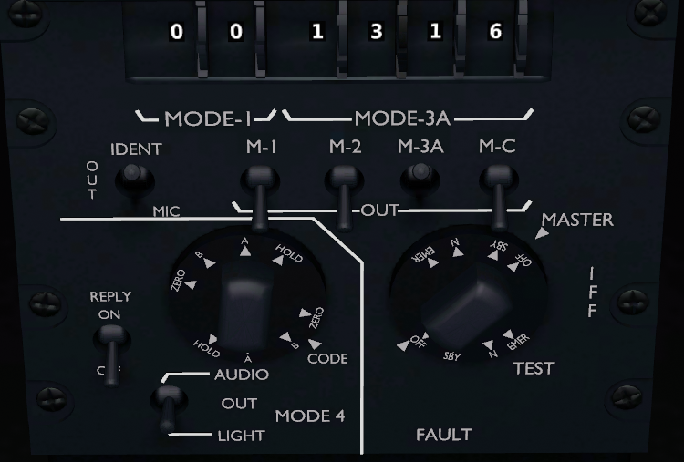

*******************
Cockpit instruments
*******************

Overview
========

.. image:: images/cockpit_instruments.png
   :alt: Overview of cockpit instruments
   :align: center

#. `Head-up display (HUD)⇗ <https://en.wikipedia.org/wiki/Head-up_display>`_ - French: `visualisation tête haute (VTH)⇗ <https://fr.wikipedia.org/wiki/Affichage_t%C3%AAte_haute>`_
#. Autopilot panel
#. Elevator trim
#. Head-level display - French: visualisation tête moyenne (VTM)
#. Physical flight instruments
#. Left `Multi-function display (MFD)⇗ <https://en.wikipedia.org/wiki/Multi-function_display>`_ - French: écran multifonction
#. Head-down display - French: visualisation tête basse (VTB)
#. Right MFD
#. Clock
#. Master Arm switch
#. Weapon command panel
#. Transponder
#. Fuel indicator panel
#. Engine indicator panel
#. External tank jettison button
#. Gear indicator
#. Gear lever
#. Light switches
#. Throttle stick
#. Elevon angle indicator
#. Cabin altimeter (non-functional)
#. Power switches
#. Alert panel
#. ILS & TACAN panel
#. Air conditioning panel
#. Interior lighting
#. Engine control panel
#. Canopy handle & lock

Please note that this cockpit model is not complete. Only instruments that have been implemented are highlighted.

HUD [1]
=======

Please refer to :ref:`link_section_hud`.

Autopilot Panel [2]
===================

Please refer to :ref:`link_chapter_autopilot`.

Elevator Trim [3]
=================

This instrument allows for the angle of the elevons to be manually offset in order to adjust the rotational angle of the aircraft along the pitch axis. It can be controlled by scrolling while hovering one's mouse over the wheel.

Please note that the influence of this instrument is rather low, and high-G manoeuvres should rely on the stick input more so than the trim.

VTM [4]
=======

Please refer to :ref:`link_section_vtm`.

Physical Flight Instruments [5]
===============================

These instruments serve as backup for the digital one, as well as when the left MFD is not on the ``EADI`` tab.

Angle of Attack (AoA) Indicator [5.1]
-------------------------------------

This gauge enables the pilot to see the angle of attack of the aircraft. One dot equals to 5° up until +15°, then 6.7° approx up until 35°. Negative AoA will not be shown.

While the onboard computer always attempts to keep the Mirage out of a stall (>25° AoA) and pulling on the stick regardless of AoA is not an issue, avoiding a tailstrike (>14° AoA) on takeoff and landing is of utmost importance. As such, should the HUD not function, this indicator will have to be taken into account on these instances.

Note that this indicator might not be visible depending on your view position. Moving your head to the side will allow you to see it.

Compass [5.2]
-------------

This indicator will display the current heading in degrees. Depending on the setting of the VTB, it will use either the True North or the Magnetic North.

Airspeed Indicator [5.3]
------------------------

This indicator will display the current airspeed in knots as well as the current mach below.

Attitude Indicator [5.4]
---------------------------

Variometer [5.5]
----------------

This indicator will show the vertical speed of the aircraft at low values. Each horizontal bar corresponds to 500ft, with a shown range between -2,000ft/min and +2,000ft/min.

Altimeter [5.6]
---------------

This indicator will show the altitude above sea level, adjusted to the pressure set in the ``EADI`` tab of the left MFD.

Left MFD [6]
============

Please refer to :ref:`link_section_left_mfd`.

VTB [7]
=======

Please refer to :ref:`link_section_vtb`.

Right MFD [8]
=============

Please refer to :ref:`link_section_right_mfd`.

Clock [9]
=========

This clock will display the time in UTC.

Master Arm Switch [10]
======================

This switch sets all weapon stations as well as the onboard cannon on live fire mode, and must be toggled on to fire any type of armament. It is off by default.

This switch should only be turned on in combat situations.

Weapon Command Panel [11]
=========================

[Not implemented]

.. _link_section_transponder:

IFF Transponder [12]
====================

The Mirage 2000 IFF transponder panel includes both civil and military functionality. A `Transponder⇗ <https://en.wikipedia.org/wiki/Transponder_(aeronautics)>`_ assists air traffic control to identify an aircraft. See :ref:`link_chapter_iff` for information on IFF.

According to the RAZBAM M2000 DCS manual [ref: D04] the modelled transponder is a ``NRAI-7C``.

NB: the generic FlightGear civil transponder can be accessed using menu item ``Radio Settings`` (``Key: F12``) in menu ``Equipment``. There is a description in an `FG wiki article⇗ <https://wiki.flightgear.org/Transponder>`_ and it will therefore not be described further here. However, you should use the Mirage transponder panel instead of the ``Radio Settings``, because the two are not fully compatible and the 3D panel does not consistently update by settings through the dialogue. If you nevertheless use the built-in dialogue, then make sure to use the "Close" button on the dialogue to close it - otherwise the ``IDENT`` button will remain pressed if you have pressed it.

Upper Part of Panel
-------------------

The top left 2 wheels ``Mode-1`` do not work. The top 4 right wheels ``Mode-3A`` are used to input the civil transponder code (which corresponds to the value in the ``Radio Settings``).

The ``IDENT`` switch is spring loaded and can be used to respond to civil interrogations.

The military interrogation switches ``M-1`` and ``M-2`` do not work.

The ``M-3A`` switch works for civil identification interrogation (mode A) and the ``M-C`` (mode C) works for civil altitude reporting interrogation. Only one of them can be active, but both can be off.

The modelled transponder NRAI-7C does not support `interrogation mode⇗ <https://en.wikipedia.org/wiki/Aviation_transponder_interrogation_modes>`_ S.

Mode-4 Subpanel
---------------

The position of the bottom left switch ``Reply`` determines whether the IFF interrogation functionality is powered ``ON`` or ``OFF``.

For an interrogation to be answered, several things need to be in place:

* The ``Reply`` switch is ``ON``.
* The selector is on either ``A`` or ``B``. The IFF channel value for A and B are set in menu item ``Mission Preplanning`` accessed through menu ``Mirage 2000`` (if damage is on, then it can only be done on ground).
* The master selector is on ``N``.

Setting the selector to ``ZERO`` will zero out the IFF channel A and B values. Know what you are doing, because to new values need to be input through the ``Mission Preplanning`` dialogue, which might not be available in flight!

According to [ref: D04] position ``HOLD`` "prevents the zeroizing of the MODE 4 IFF codes when the IFF transponder is turned off." This is not implemented: there is not zeroizing modelled when the aircraft looses power etc. If the selector is on ``HOLD`` then no response will be given.

The Audio-Out-Light switch is not implemented.

Master Subpanel
---------------

Changing the selector to ``N`` automatically sets ``M-3A`` if neither ``M-3A`` nor ``M-C`` is set. Changing the selector to ``EMER`` automatically sets ``M-3A`` no matter the setting for ``M-3A`` and ``M-C``.

``N`` (neutre) means that civil interrogations for ``M-3A`` or ``M-C`` are enabled, military interrogations for mode 4 are enabled and military interrogations for modes 1 & 2 are enabled (but modes 1 & 2 are not implemented).

NB: even if the selector is on ``N``: an actual interrogation still needs to be replied to using the ``IDENT`` switch for civil interrogations or the ``Reply`` switch for military interrogations in mode 4.

IFF Interrogator Panel
----------------------

In the real Mirage aside the transponder panel there is also an IFF interrogator panel on the right console near the ILS & TACAN panel. This is not implemented - i.e. you cannot see it in 3D and you currently cannot interrogate other aircraft from the Mirage.

Fuel Indicator Panel [13]
=========================

Displays the remaining fuel in kg (Note that the amounts in the ``Equipment -> Fuel and payload`` menu are displayed in lbs, with 1 lbs = 0.45 kg or 1 kg = 2.2 lbs approximately).

``GAUGE`` will be the total amount of fuel in the internal tanks (feeding system aside).

``REMAIN`` will also account for the feeding line and the external tanks.

``BINGO`` is a value that can be manually set in the ``Mirage 2000 -> Configuration`` menu. It should be set as the minimum fuel required to return to base (RTB) - having less than this will cause the fuel indicator to flash red, signalling the pilot to urgently RTB. By default, it is set at 480kg, which is a rather low value.

The white Mirage-shaped indicator on the left displays in white sections of the fuel system that are not empty, and in black if they are devoid of any fuel. The upper two rectangles account for both the forward and backward fuselage tanks of each side, and the pentagons for the wing internal tanks. When taking external tanks, they will be displayed as white disks below the aforementioned shapes.

Note that the fuel system will first attempt to empty the external tanks before using the fuel contained in the internal system. If the tanks are jettisoned, the fuel flow will automatically switch to internal tank feed.

Engine Indicator Panel [14]
===========================

This indicator will display information about the engine's speed and fuel consumption.

The top value ("N%") displays the ratio of the engine's speed to its maximum military power (i.e. without afterburners). In the idle state, it should be stable at around 47%, and at maximum military power at around 96%. Using afterburners will push this value above 100%.

The bottom left value shows the estimated fuel consumption per minute in kg. Note that this is an instantaneous estimation, which means changes in altitude, speed, etc, will affect it.

The bottom right value displays the number of engine rotations per minute (RPM).

External Tank Jettison Button [15]
==================================

Self-explanatory name. This does not jettison weapons attached to the pylons of the aircraft.

Jettisoning the tanks should only be done in dogfight situations or in case of emergency - they come from taxpayers' money, after all.

Gear Indicator [16]
===================

Will display three green downward arrows when the gear is fully lowered. These indicators will disappear once the gear is moving or retracted.

Gear lever [17]
===============

Lowering the lever will lower the gear, and raising it will retract the gear. Using the ``g`` and ``G`` keys (retract and extend gear respectively) will do the same, but also switch to the ``NAV`` and ``APP`` modes respectively.

Light Switches [18]
===================

#. Taxi/landing light. Off by default.
#. Dorsal flash lights. On by default. Should be manually turned off after startup.
#. Formation lights (stripes on the sides of the fuselage and tail). On by default.
#. Tail position lights. On by default.
#. Wing position lights. On by default.

Throttle Lever [19]
===================

Cannot be moved via the mouse, only with ``Key: PageUp`` and ``Key: PageDown``. Afterburners are enabled at 90% of the lever's maximum extension.

NB: this value is different in a real Mirage 2000, where it lies at 75%.

Elevon hydraulic pressure indicators [20]
=========================================

Not functional.

Cabin Altitude Indicator [21]
=============================

Not functional.

Power Switches [22]
===================

The red power switch toggles the battery on/off. The battery should be on at all times when the engine is running. Off by default.

The grey switches toggle all the alternators at once. They should be on at all times when the engine is running. Off by default.

Alert Panel [23]
================

[Default state of the alert panel when launching the simulation]

The warning lights should all be off in a normal situation (save for the parking brake when stopped on the ground). Depending on the severity of the warning, you might have to review the cockpit's switches, carry out an emergency landing, or eject. Their following codes are as follows:

======= ====================================================================
Abbrev  Alert
======= ====================================================================
BATT    Battery off
TR      Alternators off
ALT.1   Alternator 1 off
ALT.2   Alternator 2 off
OIL     Oil pressure too low
T7      N/A
CMPTR   Computer failure
RPM     RPM too high
VSD     N/A
LP      Fuel flow irregular
LLP     Left fuel pump off
RLP     Right fuel pump off
HYD.1   1st hydraulic system failure
HYD.2   2nd hydraulic system failure
EMG HYD Emergency hydraulic system failure
EP
BINGO   Fuel lower than ``BINGO`` value set
CAB P   Cabin pressure too low
TEMP    Temperature too low
OX REG  Engine oxygen flow irregularity
5mn OX  Low oxygen (5min remaining) (not implemented)
HA OX   Cockpit oxygen system failure
PITOT   Pitot tube failure
DC      N/A
CONDIT  Air conditioning failure
CONF    N/A

GAIN    N/A
SCOOP   NACA scoop failure
FLT ENV Flight envelope failure (aircraft no longer flyable)
S CONES Supersonic cone failure
EL B UP N/A
AOA     Too high AoA
SLATS   Slats failure
MAN     N/A
T/O     N/A
PARK    Parking brake enabled
AP      Autopilot failure
======= ====================================================================

ILS / TACAN Panel [24]
======================

The ``VOR.ILS`` value can be tuned to an airport's instrumental landing system frequency in order to help with the landing. When in ``APP`` flying mode and if the ILS is enabled, you will be able to visualise the corresponding airport's runway in the HUD. The left knob changes the frequency by 1 MHz and the right knob by 0.05 MHz. The left knob's real function to set the system on (``M``) or off (``A``) is not implemented. Neither are the rights knob's testing functions.

Alternatively the frequency can be changed as NAV1 using the Radio Management Unit (see :ref:`link_subsection_RMU`) or menu item ``Radio Settings`` (``Key: F12``) in menu ``Equipment``.

The ``TACAN`` allows the pilot to change the numerical value of the TACAN channel. The left knob (in the centre) changes it by 10 and the right knob by 1. To switch between the ``X`` and ``Y`` band the left knob's border can be used. The TACAN operational mode cannot be changed in any way.

Alternatively the TACAN channel can be changed using the Radio Management Unit (see :ref:`link_subsection_RMU`) or menu item ``Radio Settings`` (``Key: F12``) in menu ``Equipment``.

Air Conditioning Panel [25]
===========================

The ``COND`` switch toggles the air conditioning inside the cabin. Off by default.

The knob to its right allows the pilot to set the desired air temperature of the air conditioning. Pointing the hand of the knob towards upper half will make use of the automatic temperature regulation system, while the lower half will switch to manual control of the temperature of the airflow (and is not advised). Each movement of the hand (in-sim) will offset the temperature by 1.33°C from the default temperature (22°C AUTO). Turning the knob to the right makes the temperature cooler, and to the left makes it warmer. It is advised to set the temperature to around 17-18°C AUTO.

The ``DESEMB`` switch toggles the windshield fog removal (French: désembuage). Off by default. It is highly advised to turn it on for medium-to-high-altitude flights.

Interior Lighting Panel [26]
============================

Controls the cockpit lights.

Engine Control Panel [27]
=========================

[Default state of the engine control panel when launching the simulation]

Panel used for starting up the engine.

In order of the startup sequence:

#. Engine cut-off switch. Enabled by default.
#. Cover of the cutoff switch. Closing it disables the cutoff switch. Open by default.
#. Left fuel pump switch. Off by default.
#. Right fuel pump switch. Off by default.
#. Startup mode switch. Off by default.
#. Pump BP switch. Off by default.
#. Starter button cover. Closed by default.
#. Starter button. Pressing it for a few seconds gives the engine the necessary rotational speed to keep turning on its own.

Canopy Handle & Lock [28]
=========================

Clicking the canopy handle will switch between almost closed and fully opened states. When the canopy is almost closed, clicking the locking lever will fully close and secure the canopy. The canopy is fully opened by default.

Pressing ``d`` twice equates to clicking the canopy handle and the locking lever (and thus closes the canopy from the default state, or opens it completely if it is closed).