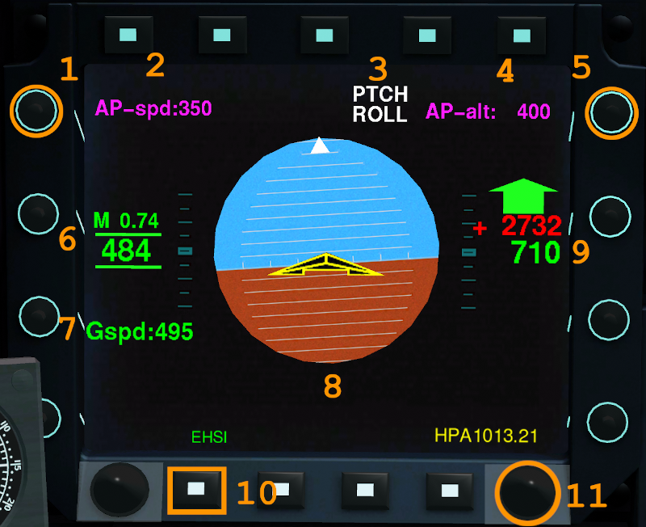
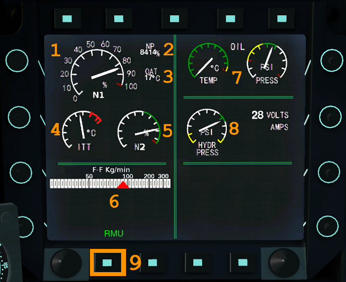
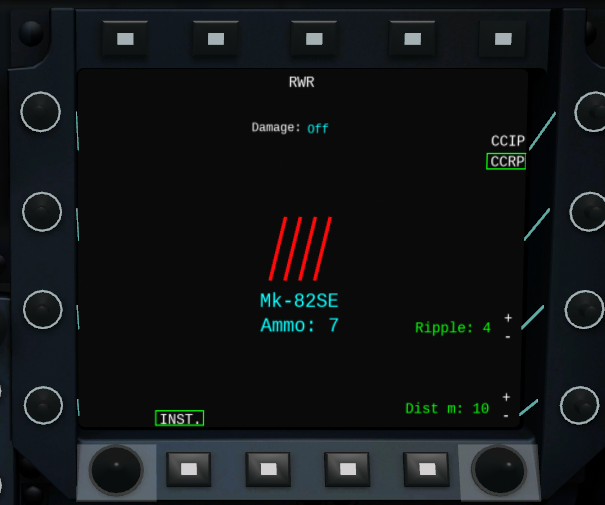

********************************
The Mirage 2000-5 Display System
********************************

The Mirage 2000-5 has its name from the fact that it has 5 main displays:

* Pink - `Head-up display (HUD)⇗ <https://en.wikipedia.org/wiki/Head-up_display>`_ - French: `visualisation tête haute (VTH)⇗ <https://fr.wikipedia.org/wiki/Affichage_t%C3%AAte_haute>`_
* Amber - Head-level display - French: visualisation tête moyenne (VTM)
* Red - Head-down display - French: visualisation tête basse (VTB)
* Blue - Left and right `Multi-function display (MFD)⇗ <https://en.wikipedia.org/wiki/Multi-function_display>`_ - French: écran multifonction

Currently all simulated variants use this system, because they use the same cockpit. In real life the cockpit of e.g. the -D variant looks quite different and does not have the right MFD not does it have the VTM.

.. _link_section_hud:

HUD
===

NB: Some description of information displayed in the HUD is included in other sections.

Acceleration Vectors
--------------------

The acceleration vectors (aka. `chevrons⇗ <https://en.wikipedia.org/wiki/Chevron_(insignia)>`_) indicate the current acceleration. If they are diaplyed above the flight path vector (the little airplane), then the aicraft is accelerating (gaining speed). A specialty of the M2000-5 version is that the chevrons are double when the afterburner is on, otherwise single.

.. image:: images/hud_chevrons_ab.png
   :align: center
   :scale: 50%

If the chevrons are displayed below the flight path vector, then the aircraft is currently slowing down.

.. image:: images/hud_chevrons_slow.png
   :align: center
   :scale: 50%

Ground Sub-mode
---------------

This mode clears much of the screen and displays 2 unique indicators:

* A box showing the longitudal acceleration in Gs (can be negative when slowing down). It is mostly used for checking the engine performance at take off. The values are typically well below 1.0 and depend on the thrust of the engine, the air resistance and the weight.
* An inverted ``T`` - the rotation index. Putting this line on the horizon at rotation speed will set the aircraft at a pitch angle of 13 degs, which is the desired angle to take off and avoids tail strikes. During landing and aero braking when only the 2 main wheels are on the ground the inverted ``T`` can help to keep the angle of attack at around 13 degs.

.. image:: images/hud_inverted_t_takeoff.png
   :align: center
   :scale: 50%

.. _link_section_vtm:

VTM
===

This is a specialty of the Mirage 2000-5. Being positioned just below the HUD, this screen allows the pilot to see radar related information without moving the head. Like the HUD the VTM's focal point is perceived to be at infinity.

.. image:: images/vtm_intro.png
   :alt: VTM Default Display
   :align: center

Most radar pictures are displayed in a B-scope (see picture above), the sea and ground radar modes are displayed as Plan Position Indicator - cf. `Radar Displays⇗ <https://en.wikipedia.org/wiki/Radar_display>`_ on Wikipedia.

The top left corner shows the radar main mode (``Key: Q`` to cycle) and the radar sub-mode (``Key: ctrl-q`` to cycle). In the top middle the radar range in nm is displayed (``Key: R`` to increase, ``Key: E`` to decrease). The box in the top right corner shows data from the cursor: ``Θ`` shows the the heading of the cursor, ``Ρ`` shows the distance of the cursor on the radar.

The cursor can be moved with arrow keys on the keyboard or using a binding to a joystick. On the left side of the cursor the radar distance is shown, on the left side the top and bottom altitudes being scanned by the radar (in ft).

At the bottom of the screen there is a heading scale (showing true of magnetic North depending on the setting done on the VTB). At the bottom on the left the three main weapon guidance modes are displayed: radar (RDR), laser designation point (LDP), GPS. The currently used guidance mode is displayed inside a box and can be changed using ``Key: M``.

The scale on the left side shows the radar antenna elevation / radar pitch. The number shows the number of bars (vertical scanning of the radar). The antenna elevation can be changed (``Key: i`` for up, ``Key: I`` (capital i) for down, ``Key: Y`` for level).

Air-to-Air
----------

A flying target is shown as an open rectangle with a line showing the direction the target is flying at (the longer the line, the faster).

.. image:: images/vtm_crm_tws.png
   :alt: Air-to-Air Target Display
   :align: center

In TWS mode a target can be selected using ``Key: y`` (and deselected with ``Key: ctrl-y``). When the target is selected, then the display is changed to a small cross (still with a line indicating the direction) and the targets identifier is displayed in the lower right corner.

.. image:: images/vtm_crm_tws_selected.png
   :alt: Selected Air-to-Air Target
   :align: center

To select a target in another air-2-air or air-2-ground or air-2-see mode, the cursor must be moved over the middle of the target and then designated using ``Key: l`` (small L).

.. image:: images/vtm_crm_rws.png
   :alt: Target Designation
   :align: center

Air-to-Sea
----------

Like all ground modes the radar picture is displayed as PPI.

In air-2-sea mode the target is selected and designated using the cursor. A not designated target is shown as a diamond.

.. image:: images/vtm_sea.png
   :alt: Air-to-Sea Target (Undesignated)
   :align: center

When selected the target is shown as a cross. There is no information about direction / speed displayed.

.. image:: images/vtm_sea_selected.png
   :alt: Air-to-Sea Target (Selected)
   :align: center

Air-to-Ground
-------------

The following picture shows a few targets in ground mode (like for sea targets they are displayed as diamonds). Notice that the antenna elevation has been lowered a few degrees (radar pitch scale at left side) and one of the targets (boxed) has been designated using the laser - and therefore the LDP guidance mode is highlighted.

.. image:: images/vtm_ground.png
   :alt: Air-to-Ground Targets
   :align: center

.. _link_section_vtb:

VTB
===

The head-down display is currently basically a copy of a Navigation Display you would find in an Airbus - and thus not yet implemented as per the original.

..
   Actually it is using https://wiki.flightgear.org/Canvas_ND_framework

The buttons around the screen influence settings as follows:

.. image:: images/vtb_buttons.png
   :scale: 60%

#. Show/hide airports
#. Show/hide waypoint data
#. Show/hide waypoints
#. Show/hide position points
#. Show/hide weather data
#. On/off button
#. Set range in nautical miles (distances: 10; 20; 40; 80; 160; 320)
#. Cycle pages: PLAN, VOR, APP, MAP
#. Toggle liquid crystal display/cathode ray tube display (does not really do anything)
#. Toggle centre ND
#. Toggle true/magnetic heading

.. _link_section_left_mfd:

Left MFD
========

To change the currently displayed page, use the left button on the button row at the bottom of the screen.

The different pages of this MFD are the ``EADI`` (electronic attitude direction indicator), the ``EHSI`` (electronic horizontal situation indicator), the ``EICAS`` (engine indicating and crew alerting system) and the ``RMU`` (radio management unit).

.. _link_subsection_EADI:

Electronic Attitude Direction Indicator (EADI)
----------------------------------------------

#. Autopilot speed adjustment knob (+/- 5kts)
#. Autopilot desired speed
#. Autopilot status indicator (AP1/blank, PTCH/VS/ALT/TF, ROLL/HDG/LNAV)
#. Autopilot desired altitude (ASL or AGL for ALT/TF autopilot modes respectively)
#. Autopilot altitude adjustment knob (+/- 50ft)
#. Airspeed in mach and kts
#. Ground speed in kts
#. Attitude indicator
#. ASL Altimeter in ft (green number) and variometer in ft/min (in red). The green arrow's extention is proportional to the vertical speed of the aircraft.
#. Switch to ``EHSI`` page
#. Set QNH (+/- 0.34HPa)

If applicable, the name of the route's next waypoint or target airport will be shown below the attitude indicator.

.. _link_subsection_EHSI:

Electronic Horizontal Situation Indicator (EHSI)
------------------------------------------------

#. Red arrow status, cycles through hidden, ``NAV1``, ``TACAN``, ``ADF2``. Hidden by default.
#. Yellow arrow status, cycles through hidden, ``NAV2``, ``ADF1``. Hidden by default.
#. Toggle the visibility of the atmospheric conditions (wind orientation, speed in kts, outside air temperature in °C, dewpoint in °C). They are shown in bright green at the top right of the screen. The wind's direction is also shown in relation to the aircraft with the small bright green compass.
#. Horizontal situation indicator. It displays in bright green triangles the orientation of the aircraft (0°, 45°, 90°, etc).
#. Heading bug adjustment knob (+/- 1°). It is displayed as a white dented rectangle on the rim of the compass.
#. Switch to the ``EICAS`` page
#. Cycle between autopilot navigation sources: ``NAV1``, ``NAV2``, ``TACAN`` (all three set in the ``RMU`` page of this same MFD) and ``FMS`` (route set in ``Autopilot -> Route manager``). The selected source and evental additional information will be displayed in blue text. This also controls the blue arrow's status.
#. Navigation heading adjustment knob (+/- 1°). Only applicable if ``NAV1`` and/or ``NAV2`` do not have a valid navigation frequency set.

Engine Indicating and Crew Alerting System (EICAS)
--------------------------------------------------

#. Ratio of the engine's speed to its maximum military power
#. Numerical value of the aforementioned ratio. Note that it is in 1/10,000 and not in %.
#. Outside air temperature in °C
#. Internal turbine temperature
#. Throttle (green range only)
#. Fuel consumption in kg/min
#. Oil temperature in °C and oil pressure
#. Hydraulic system pressure
#. Switch to the ``RMU`` page

.. _link_subsection_RMU:

Radio Management Unit (RMU)
---------------------------

#. Cycle through and the available channels on the left-hand side of the page (None, ``COMM1``, ``COMM2``, ``NAV1``, ``NAV2``). Having one channel selected will enable the pilot to edit its parameters.
#. Swap the active and inactive frequencies of the selected left-hand side channel
#. Knob to adjust the selected left-hand side inactive channel's frequency (+/- 1 MHz)
#. Knob to adjust the selected left-hand side inactive channel's frequency (+/- 0.05 MHz)
#. Swap the active and inactive frequencies of the selected right-hand side channel
#. Cycle through and the available channels on the left-hand side of the page (None, ``ADF1``, ``ADF2``, ``TACAN``).
#. Knob to adjust the selected left-hand side inactive channel's frequency (+/- 10 kHz) if ADF is selected, otherwise adjust the TACAN channel (+/- 1)
#. Knob to adjust the selected left-hand side inactive channel's frequency (+/- 1 kHz) or switch the TACAN mode (X/Y)
#. Switch to the ``EADI`` page

.. _link_section_right_mfd:

Right MFD
=========

To change the currently displayed page, use the second button from left (cyan colour) on the button row at the top of the screen. The text below the button shows the current page name, but leads back to the page hub. From the hub you can access all available pages.

.. image:: images/hub_page.png

Use the mouse wheel to push the toggles on the left and right side of the MFD up and down. Only those toggles work, which have a text associated on the screen.

You can also change the view with ``Key: N`` to better see the right MFD (and the VTB). Use ``Key: ctrl-n`` to go back to the default view.

NB: you cannot display pages from the right MFD on the left MFD or the VTB.

.. _link_subsection_sms:

Store Management system (SMS)
-----------------------------

The SMS page shows the currently loaded weapons incl. external tanks. A few things to note on the picture below:

* The red text on the left indicates that the load type for the Flight Control System should be changed given the heavy load of bombs. That can be done with the toggle at the bottom left.
* A gun is loaded (CC422 gun pod on a M2000D) and therefore at the top to the left you can see the remaining bullet count. If the page would be displayed in a M2000-5, then "CAN" would be displayed each of the 2 cannons.
* The currently selected store will have a yellow rectangle border. You can only select weapons (using ``Key: w``) and only the first available weapon of the same type.
* The red stripes in the middle indicate that there is weight on wheels.
* At the top of the page below the middle button you can read "PPA" - which will be the next page displayed.

The abbreviations used for the stores are available in the weapons overview table in :ref:`link_section_overview_weapons` (a number in front of the abbreviations means the number of this weapon at the station).

.. _link_subsection_ppa:

Poste de Préparation Armement (PPA)
-----------------------------------

The PPA is a weapons configuration panel. In the middle of the screen it shows the selected weapon plus the remaining number of this type.

At the top of the page a reminder for the pilot is displayed: "Damage: Off" means that the OPRF damage has not been enabled and therefore weapons will not generate damage when they hit something.

The displayed menus depend on the chosen weapon and sometimes on previously chosen menu items (e.g. the ripple distance is only shown, if ripple mode is set to more than 1).

.. _link_subsection_rwr:

Radar Warning Receiver (RWR)
----------------------------

The radar warning receiver (`RWR⇗ <https://en.wikipedia.org/wiki/Radar_warning_receiver>`_) screen is actually a combination of a RWR display and a counter-measures dispenser display.

.. image:: images/rwr_intro.png
   :alt: RWR Display
   :align: center

On the left side of the screen there are 2 menu items for the RWR:

* Separation: whether the symbols should be dispersed a bit to make them more readable (but this changes the relative bearing).
* Unknown: whether to show radar sources, which cannot be interpreted.

RWR
^^^

.. image:: images/rwr_symbols.png

The RWR displays a maximum of 12 threats. High level threats (e.g. with an STT lock or actively guiding a missile) are displayed within the blue centre ring. Lower level threats are displayed closer to the outer ring. I.e. the distance from centre is an interpretation of threat and not a real distance. The position is a top-down view around your aircraft (nose towards up/North).

Different types of threats are displayed with different symbols according to USA/NATO standards (i.e. not according to French symbology at the moment). ``U`` is for unknown threat, ``S`` is for surveillance aircraft (e.g. `AWACS⇗ <https://en.wikipedia.org/wiki/Airborne_early_warning_and_control>`_ - which typically cannot shoot), and ``AI`` is for aircraft which have not yet been classified in OPRF.

.. image:: images/rwr_locked.png
   :alt: RWR Threat Symbols
   :align: center

If there is a chevron below the symbol, then the threat has a radar lock on you. If there is a hat on top of the symbol, then the threat is either source to an active missile or guiding a semi-active missile.

Only one missile in the air can be displayed - even though several might be in the air at the same time. The missile is shown with the symbol ``W`` close to the centre - again the distance is not the real distance and only the bearing relative to your aircraft is shown. If a missile is in the air, then the related threats are blinking once per second.

In addition to the visual indications there are sounds (refreshed every 0.5 seconds):

* A new threat has been detected: continuous 1 kHz tone for 0.5 seconds.
* A new radar lock (STT) has been detected: 1 kHz tone chopped at 25Hz for 0.5 seconds.
* A semi-active missile is being supported: 1 kHz tone chopped at 25Hz for 0.5 seconds repeating after 0.5 seconds of silence.
* An active radar missile is in the air: continuous 1 kHz tone chopped at 25Hz until the missile is not detected any more.

Counter-Measures Dispenser Display
^^^^^^^^^^^^^^^^^^^^^^^^^^^^^^^^^^

At the right side of the RWR there are 4 indicators for dispensed counter-measures (flares and chaff). It is a "could-be" interpretation of the decoy dispenser lights on the right top of the M2000-C canopy.

* ``LL`` = decoy dispenser (Lance-Leurres) - blue: blinks when counter-measures are being dispensed.
* ``EM`` = chaff (Électro-magnétique) - amber: blinks when remaining quantity is at or below 20. Steady light when remaining quantity is at 0 (empty).
* ``IR`` = flares (Infrarouges) - amber: blinks when remaining quantity is at or below 20. Steady light when remaining quantity is at 0 (empty).
* ``EO`` = electro-optical (Électro-optique) - amber: not simulated.

The total quantity of counter-measures simulated is 120. 2 are dispensed every second. No difference is made between flares and chaff in the simulation. Use ``Key: q`` to start dispensing and ``Key: q`` to stop dispensing.

Map
---

The map page is a temporary replacement for a real implementation in the VTB. Using the lower right toggle you can zoom and and out of the map.

The map is based `OpenStreetMap⇗ <https://osm.org>`_ and shows only the position of one's own aircraft in the middle.

Depending on the network connection it might take a while for parts of the map (tiles) to load. Once loaded the tiles get cached and should therefore be available further on.

Electronic Horizontal Situation Indicator (EHSI)
------------------------------------------------

NB: this page is under construction - you might want to use the page on the left MFD instead (cf. :ref:`link_subsection_EHSI`).

.. image:: images/ehsi_page.png

The FlightGear wiki has a quite comprehensive page about `Radio Navigation⇗ <https://wiki.flightgear.org/Radio_navigation>`_ with a fair amount of links.

Compass
^^^^^^^

The compass rose is turning as the airplane turns. The current heading is at the top (where North is on a compass). You can toggle between true North heading (TH) and magnetic North heading (MH) with the know in the left side.

Current Selected Course
'''''''''''''''''''''''

The big green arrow shows the current selected course for either NAV1 or NAV2. NAV1/NAV2 can be toggled with a button on the right side of the top button row. The course can be corrected with the +/- knob on the right side: + changes by +10 degrees, minus changes by -1 degree.

Heading Towards Selected Destination
''''''''''''''''''''''''''''''''''''

The blue arrow shows the direction towards the selected destination, which depends on the mode (``VOR``, ``DATA``, ``TAC``) and the actual selection within the mode.

Data Presented
^^^^^^^^^^^^^^

On the left hand side:

* The mode: If VOR is selected and it is an ILS station, then ``ILS`` is displayed as soon as the glidescope information is in range.
* ``...N``: Distance to destination in nautical miles. If there are only dots and no number, then the station is not yet in range for distance calculation. The distance for ILS is displayed for the glidescope when available, else as VOR.
* ``...M``: Time to destination in minutes and seconds given current speed (or 400 kt if speed is below 100 kt). The calculation depends on the availability of the distance.
* The name of the VOR/ILS station if available (e.g. ``EHE``). Typically, ILS stastions start with an "I" in the name.
* The TACAN channel (e.g. ``029X``)

The data points beloning to the currently selected mode (e.g. VOR vs. TACAN) are shown in cyan colour, otherwise white.

Wind
^^^^

On the lower right side you can see the actual wind direction and wind speed. Please be aware that the indicated wind direction is relative to the aircraft (like the compass rose).

Electronic Attitude Direction Indicator (EADI)
----------------------------------------------

NB: this page is under construction - you might want to use the page on the left MFD instead (cf. :ref:`link_subsection_EADI`).
