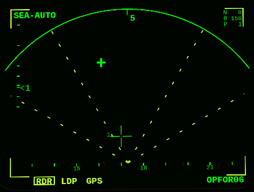

*********************************
The Mirage 2000-5 Display Systems
*********************************

The Mirage 2000-5 has its name from the fact that it has 5 main displays:

* `Head-up display (HUD) <https://en.wikipedia.org/wiki/Head-up_display>`_ - French `Visualisation tête haute (VTH) <https://fr.wikipedia.org/wiki/Affichage_t%C3%AAte_haute>`_
* Left and right `Multi-function display (MFD) <https://en.wikipedia.org/wiki/Multi-function_display>`_
* Head-level display - French Visualisation tête moyenne (VTM)
* Head-down display - French Visualisation tête basse (VTB)

VTM
===

This is a specialty of the Mirage 2000-5. Being positioned just below the HUD, this screen allows the pilot to see radar related information without moving the head. Like the HUD the VTM's focal point is perceived to be at infinity.

.. image:: images/vtm_intro.png
   :alt: VTM Default Display
   :align: center

Most radar pictures are displayed in a B-scope (see picture above), the sea and ground radar modes are displayed as Plan Position Indicator - cf. `Radar Displays <https://en.wikipedia.org/wiki/Radar_display>`_ on Wikipedia.

The top left corner shows the radar main mode (``Key: Q`` to cycle) and the radar sub-mode (``Key: ctrl-q`` to cycle). In the top middle the radar range in nm is displayed (``Key: R`` to increase, ``Key: E`` to decrease). The box in the top right corner shows data from the cursor: Θ shows the the heading of the cursor, Ρ shows the distance of the cursor on the radar.

The cursor can be moved with arrow keys on the keyboard or using a binding to a joystick. On the left side of the cursor the radar distance is shown, on the left side the top and bottom altitudes being scanned by the radar (in ft).

At the bottom of the screen there is a heading scale (showing true of magnetic North depending on the setting done on the VTB). At the bottom on the left the three main weapon guidance modes are displayed: radar (RDR), laser designation point (LDP), GPS. The currently used guidance mode is displayed inside a box and can be changed using ``Key: M``.

The scale on the left side shows the radar antenna elevation / radar pitch. The number shows the number of bars (vertical scanning of the radar). The antenna elevation can be changed (``Key: i`` for up, ``Key: I`` (capital i) for down, ``Key: Y`` for level).

Air-to-Air
----------

A flying target is shown as an open rectangle with a line showing the direction the target is flying at (the longer the line, the faster).

In TWS mode a target can be selected using ``Key: y`` (and deselected with ``Key: ctrl-y``). When the target is selected, then the display is changed to a small cross (still with a line indicating the direction) and the targets identifier is displayed in the lower right corner.

To select a target in another air-2-air or air-2-ground or air-2-see mode, the cursor must be moved over the middle of the target and then designated using ``Key: l`` (small L).

Air-to-Sea
----------

Like all ground modes the radar picture is displayed as PPI.

In air-2-sea mode the target is selected and designated using the cursor. A not designated target is shown as a diamond.

When selected the target is shown as a cross. There is no information about direction / speed displayed.

Air-to-Ground
-------------

The following picture shows a few targets in ground mode (like for sea targets they are displayed as diamonds). Notice that the antenna elevation has been lowered a few degrees (radar pitch scale at left side) and one of the targets (boxed) has been designated using the laser - and therefore the LDP guidance mode is highlighted.

.. image:: images/vtm_ground.png
   :alt: Air-to-Ground Targets
   :align: center

Right MFD
=========

Radar Warning Receiver (RWR)
----------------------------

On the right MFD when clicking left most button below the screen you can switch to the radar warning receiver (`RWR <https://en.wikipedia.org/wiki/Radar_warning_receiver>`_) screen.

The screen is actually a combination of a RWR display and a counter-measures dispenser display.

.. image:: images/rwr_intro.png
   :alt: RWR Display
   :align: center

The RWR displays a maximum of 12 threats. High level threats (e.g. with an STT lock or actively guiding a missile) are within the blue centre ring, lower level threats are closer to the outer ring. I.e. the distance from centre is an interpretation of threat and not a real distance. The position is a top-down view around your aircraft (nose towards up/North).

Different types of threats are displayed with different symbols according to USA/NATO standards (i.e. not according to French symbology at the moment). ``U`` is for unknown threat, ``S`` is for surveillance aircraft (e.g. `AWACS <https://en.wikipedia.org/wiki/Airborne_early_warning_and_control>`_ - which typically cannot shoot), and ``AI`` is for aircraft which have not yet been classified in OPRF.

.. image:: images/rwr_locked.png
   :alt: RWR Threat Symbols
   :align: center

If there is a chevron below the symbol, then the threat has a radar lock on you. If there is a hat on top of the symbol, then the threat is either source to an active missile or guiding a semi-active missile. Only one missile in the air can be displayed - even though several might be in the air at the same time. The missile is shown with the symbol ``W`` close to the centre - again the distance is not the real distance and only the bearing relative to your aircraft is shown. If a missile is in the air, then the related threats are blinking once per second.

In addition to the visual indications there are sounds (refreshed every 0.5 seconds):

* A new threat has been detected: continuous 1 kHz tone for 0.5 seconds.
* A new radar lock (STT) has been detected: 1 kHz tone chopped at 25Hz for 0.5 seconds.
* A semi-active missile is being supported: 1 kHz tone chopped at 25Hz for 0.5 seconds repeating after 0.5 seconds of silence.
* An active radar missile is in the air: continuous 1 kHz tone chopped at 25Hz until the missile is not detected any more.

Counter-Measures Dispenser Display
----------------------------------

At the right side of the RWR there are 4 indicators for dispensed counter-measures (flares and chaff). It is "could-be" interpretation of the decoy dispenser lights on the right top of the M2000-C canopy.

.. image:: images/rwr_counter_measures.png
   :alt: Counter-Measures Dispenser Display
   :align: center

* ``LL`` = decoy dispenser (Lance-Leurres) - blue: blinks when counter-measures are being dispensed.
* ``EM`` = chaff (Électro-magnétique) - amber: blinks when remaining quantity is at or below 20. Steady light when remaining quantity is at 0 (empty).
* ``IR`` = flares (Infrarouges) - amber: blinks when remaining quantity is at or below 20. Steady light when remaining quantity is at 0 (empty).
* ``EO`` = electro-optical (Électro-optique) - amber: not simulated.

The total quantity of counter-measures simulated is 120. 2 are dispensed every second. No difference is made between flares and chaff in the simulation. Use ``Key: q`` to start dispensing and ``Key: q`` to stop dispensing.
