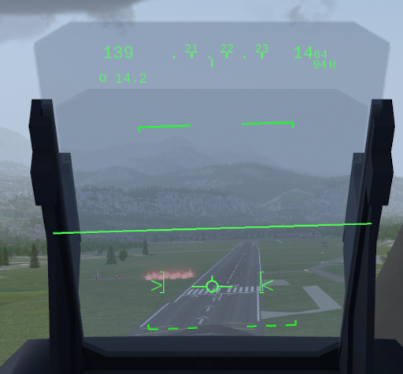
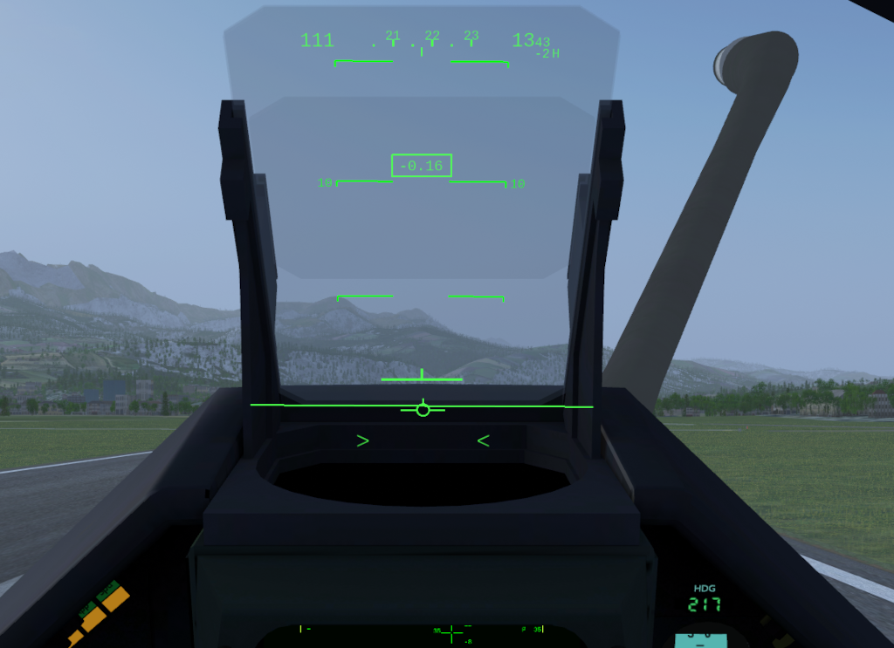
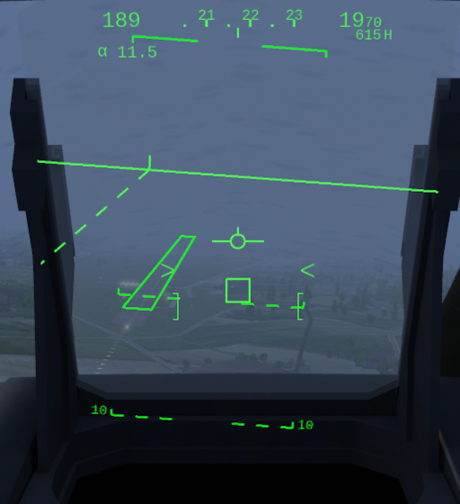

******
Flying
******

Basic Operations
================

Start-up
--------

When your aircraft is cold and dark before start-up, the external generator and fuel truck are connected to your aircraft, and protections (in red) will be on your aircraft, as well as chocks. They will disappear automatically as you start up. With the ``}`` key, you can auto-start your aircraft.

Taxi
----

The Mirage can taxi at relatively high speeds, usually below 40kts, but you shouldn't go faster than 20kts when turning. Even if the track width is larger than usual, you should always stay at safe speeds.

The front gear can turn 90° to the left and to the right, so a turn radius of 3 meters is reachable. You might need to add thrust, as it is difficult to move with the front gear almost entirely turned. Do not push on the rudder pedals too much when braking, otherwise the aircraft may fall on one side or another if you turn too tight.

The taxi lights have an angle of about 30 degrees in front of the aircraft and are not attached to the moving part of the front gear, so they will always light in front.

Take-off
--------

Line up on the best runway for the current weather conditions and ask for clearance. Once the clearance is given and after releasing the parking brake, spool up while keeping the pedal brakes enabled. Then, throttle up to 99% RPM (military power) for long runways, 100%+ (with afterburners) for short runways or with heavy loadout. Rotation speed is at 120 knots when using a clean loadout, 140 knots if with payload. After this, bring the inverted "T" in the HUD on the line of horizon and you should be able to lift off at 170-190 knots, depending on your loadout. Do not exceed 13° nose angle or you will tail-strike. Even though the Mirage is airborne, you might feel that the plane with high nose angle "floats" over the runway until reaching well beyond 200 knots. Raise the gears before reaching 260 knots with key ``g`` or by clicking the red gear lever.

The Mirage needs long runway distances to take off, as it hasn't got a separate horizontal tail stabilizer/elevator. Because of the elevons' position (trailing edge of the wing), they create a considerable loss of lift when they are moved up to rotate, so higher rotation speeds are needed. Also, the delta wing is often called "flying airbrake", as they generate lots of drag at high angles of attack, like at take-off. This is why high speeds and long runways are needed.

Initial Climb
-------------

After taking off, retract the landing gear before reaching 280kts (maximum gear extension speed). You are advised to follow the runway heading until you are at an acceptable speed (approximatively 200 knots), but if you used reheat and you are not heavy, you can turn as soon as you are at 200 knots. However, you have to watch your speed so you don't stall - at this altitude, a stall doesn't forgive.

After having chosen the correct heading and having attained 250 knots, you can commence your climb with full military power, at the beginning around 2,000 feet per minute to gain speed, and when you have reached your optimal climb speed you may pull the nose up to climb at a rate of 4,000 feet per minute. Remember that if you are faster, you will have an lower angle of attack and will thus drag less, and your elevons will not need to be pulled fully up (and thus will not create too much additional loss of lift), so it is advised to speed up before climbing too fast.

Climb
-----

The Mirage can climb exceedingly fast, with a maximum climb rate of 6,000 feet per minute. With full tanks and `air-policing⇗ <https://en.wikipedia.org/wiki/Air_sovereignty>`_ loadout, it is able to climb with full military power at a rate between 4,000 feet and 6,000 feet without bleeding speed (between 250 and 300 knots). With full afterburners and in the same conditions, the climb rate can go up to 12,000 feet, still in zero/zero conditions. If going vertical with full afterburners and a base speed of 400 knots, you can reach 20,000 feet before having to push the nose back down. This is the fastest way of climbing.

Cruise
------

The Mirage 2000 normally cruises between angels 35 and angels 40 (35,000 - 40,000 feet), and this is the best altitude for Mach 2+ flights. It can also go above 50,000 feet (the pilot would need special equipment - not simulated yet), and up to 80,000 feet, but with difficulties. The optimal cruise altitude is 36,000 feet.

While it has a bi-sonic flight possibility, it consumes lots of fuel. It is thus advised to stay sub-sonic during cruise flights, without using afterburners. With cargo loadout and without using afterburners, the Mirage can fly for more than two hours. For long cruises, it is advised to use the navigation, altitude and speed autopilots.

Visual Landing
--------------

Make sure you have plenty of height and distance to align with the runway and land. Change the flight mode to ``Approach`` (cf. :ref:`link_section_flight_modes`).

Lower the gears when you are below 250 knots, then approach the runway at 175 knots (for 15% fuel left; add 5 knots for every 20% additional fuel - and a bit more if you bring weapons home). Put the landing lights and navigation lights on. On final approach, hold an angle of attack of ca. 14 degrees. When passing the runway threshold, do a short flare and hold angle of attack at ca. 14 degrees. You should land at 145 knots (for 15% fuel left; add 5 knots every 20% additional fuel).

The HUD helps with visual landing. Once aligned with the runway, put the flight path vector on the runway threshold, make sure that the flight path vector is between the 2 approach brackets in the lower part of the HUD (indication for `angle of attack (AoA)⇗ <https://en.wikipedia.org/wiki/Angle_of_attack>`_ is at degrees) and use the throttle to keep the AoA as well as the speed in the right regime:

The height of the approach bracket is 1° (+/- 0.5 deg from 14).

When touching down and the 2 main wheels are on ground, the HUD automatically changes to flight mode ``Ground``. Keep the nose up at around 13 degrees to do aerodynamic braking (cf. image below - inverted "T" cue in the HUD is a bit high and should be on the line of horizon). Wait for the aircraft to slow down to at least 135 knots, bring the nosewheel down and first then apply pedal brakes. Use the brake parachute (key ``o`` to deploy) if necessary (heavy loadout or short runway) - and then release when not needed any more (same key ``o``). Aerodynamic breaking using a high angle of attack when landed is normal procedure. However, do not tilt the aircraft more than 13 degrees due to the possibility of a tail strake. NB: it is by procedure forbidden to use aerodynamic braking below 100 kts - even though it might be possible: you have to get weight on the nose wheel. The reason for this required procedure is that depending on speed, configuration, weight distribution (e.g. fuel) etc. it might suddenly not be possible anymore to bring the nose down given loss of effectiveness of the elevons vs. drag forces vs. weight forces.

Note that nose-wheel steering only be engaged below 40 kts.

Landing with ILS
----------------

In bad weather or at night the `Instrument Landing System (ILS)⇗ <https://en.wikipedia.org/wiki/Instrument_landing_system>`_ can help to find the runway. The HUD of the mirage displays cues from the ILS as shown in the next image:

* The synthetic runway.
* The stipled line to the left shows the runway axis direction. If it is not on the synthetic runway symbol, then you have to fly towards the side of the stipled line to align with the runway.
* A guidance window (square). To land correctly the airplane must be steered such that the flight path vector overlaps the guidance window - while also being correct in relation to the approach brackets (see chapter above).

A few things must be true for the symbology to be displayed:

* The ILS frequency must be set (either through menu ``Equipment -> Radio Frequencies`` or in the Radio Managment Unit (cf. :ref:`link_subsection_RMU`)) to the runway (you can get the frequency from dialogue ``Location -> Select an Airport``).
* The radial runway degrees must be set (either through menu ``Equipment -> Radio Frequencies`` or in the Electronic Horizontal Situation Indicator (cf. :ref:`link_subsection_EHSI`) - you can get the value from dialogue ``Location -> Select an Airport``).
* The radio channel must be selected.
* The runway axis and the guidance window are shown as soon as the localizer has been caught.
* The runway is only shown if both the localizer has been caught and within the glide slope (max ca. 7 degrees lateral deviation from the runway direction) and max 10 nm distance from the runway.

.. _link_section_flight_modes:

Flight Modes
============

There are 4 flight modes:

* ``Ground``: Default. Used for take-off and during aerobraking when landing.
* ``Approach``: Used during landing before touch down.
* ``Navigation``: As the name says - in the air
* ``Attack``: when a weapon is selected for air/air and air/ground attack.

NB: the real Mirage has mode modes. E.g. there are several sub-modes to navigation, which are not yet simulated.

The main difference between the flight modes are:

* The view position and zoom.
* What is displayed on the HUD (:ref:`link_section_hud`).

If there is weight on the main wheels, then fligth mode ``Ground`` is automatically selected. Otherwise the possibilities to change between the different modes is as presented in the table below (left columns: from mode; top headers: to mode):

=============== ===================== ============ ==========
From / to       Navigation            Approach     Attack
=============== ===================== ============ ==========
``Ground``      ``Key: g`` (gear up)  n/a          n/a
``Navigation``  n/a                   ``Key: h``   ``Key: w``
``Approach``    ``Key: h``            n/a          n/a
``Attack``      ``Key: h``            n/a          n/a
=============== ===================== ============ ==========

If you press the ``Key: w`` and no weapon can be selected, then mode ``Navigation`` is automatically selected.

In Cockpit Views
================

In order to see the MFDs and the VTB better as well as seeing better the gauges on each side of the VTM, you can use key bindings:

* ``Key: n``: view the left MFD and the VTB
* ``Key: N``: view the right MDF and the VTB
* ``Key: c``: view the VTM
* ``Key: ctrl-n``: reset the view to the position of the current flight mode

Depending on the flight mode you need to adjust the seat to see better - including the symbology in the HUD. At take-off you should seat low to see the symbology in the HUD. During approach/landing and ground attack your seat should be adjusted upwards, so you can see the point of the nose.

* ``Key: shift-PageUp``: adjust the seat up
* ``Key: shift-PageDown``: adjust the seat down

Other Stuff
===========

True vs. Magnetic North
-----------------------

To switch between displaying heading in true North vs. magnetic North, use the second button from right on the lower button row of the VTB.

Nose Wheel Steering
-------------------

Use ``Key: S`` to toggle nose wheel steering.

Nose wheel steering is automatically disabled above 40 kt and cannot be enabled as long as ground speed is faster than 40 kt.

The steering degree is depending on the ground speed: at 1 kt it is 45° down to 10° at 30 kt.

NB: Nose Wheel Steering is "Dirigeabilité Roue Avant" in French, which is abbreviated "DIRAV" - and therefore the name on the blueish control light on the gears panel.

Miscellaneous
-------------

* When heavily loaded, the `fly-by-wire system (FBW)⇗ <https://en.wikipedia.org/wiki/Fly-by-wire>`_ should be set correctly to lower allowable flight limits in order to save the structure. Use the SMS page (:ref:`link_subsection_sms`).
* Afterburners engage when throttle moves past 85% in real-life, 90% in-sim.
* The 1700l and 2200l droppable tanks are not supersonic, but the 1300l is.
