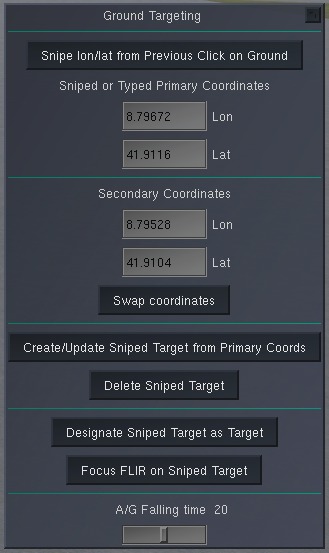

Basic Keys
==========

* `Key: m`: toggle master arm
* `Key: w`: cycle through weapons
* `Key: ctrl-w`: toggle between CCIP and CCRP
* `Key: :` (colon): toggle single or pair release of bombs (do not use with GBUs)
* `Key: ;` (semi-colon): cycle through the ripple number (number of bombs release per release between 1 and 8)
* `Key: _` (underscore): cycle through the distance between rippled release (steps of 5 metres)
* `Key: M`: cycle through weapon guidance modes (e.g. LDP for laser guided ammunition)

CCIP
====

A Constantly Computed Impact Point (CCIP) is in the Mirage shown as a line from the flight path indicator (top) to the impact point (bottom). When the impact point is just above the target, then you release the bomb(s). This shot will not have a good accuracy, because the airplane is slightly banked to the right - for a good shot the airplane should be horizontal.

.. image:: images/ground_attack_ccip_hud.png

If you use a standard [Mk82 bomb](https://en.wikipedia.org/wiki/Mark_82_bomb), then you need to start a steep dive (ca. 40 degs) from at least 10'000 ft to have enough time for aiming and for the bomb to get armed. Using the Snake-Eye retarding device (Mk82SE) you can fly pretty low without a deep dive - given enough speed.

CCRP
====

The Constantly Computed Release Point (CCRP) requires a target to have been designated - either with the cursor in ground attack radar mode or using a laser or GPS coordinates.

The following picture shows CCRP guidance for a laser guided GBU12 bomb a few seconds before the ideal release point. The diamond at the top shows with its wings that the pilot should navigate the airplane a bit to the right. The short horizontal line below the diamond gets closer from below the closer the release point is. On the right hand side the distance to the release point (not the target) is shown.

.. image:: images/ground_attack_ccrp_hud_laser_guided.png

The next picture shows a similar situation, but this time the weapon is a dumb free-fall bomb and the target has been designated using the ground radar.

.. image:: images/ground_attack_ccrp_hud_designated.png

.. image:: images/ground_attack_vtm_designated.png

Laser or GPS Designation
========================

In the `Mirage 2000` menu there is a menu point `Ground Targeting`, which will display the following dialogue:

It is important to do all steps sequentially!

You can acquire coordinates in two ways: either write the lon and lat directly into the fields - or click on the ground where you want to pick the coordinate and then press the top button (it will be disabled if no laser designation pod has been added to the airplane).

Always the primary coordinates will be used to create/update targets, but a secondary pair can be input as well. A button can swap the primary and secondary coordinates.

A sniped target (simulating what would be done with a laser) can be created with a button based on the primary coordinates. NB: the view can temporarily be changed automatically, such that the coordinate including its elevation above sea level can be fetched behind the scenes).

The target can then be designated using another button.

A FLIR view (`Key: F6`) can be activated and the button `Focus FLIR on Sniped Target` will then point the laser to the sniped coordinates. Thereby the coordinate can be improved by clicking exactly on the target through the FLIR and then updating the target.
