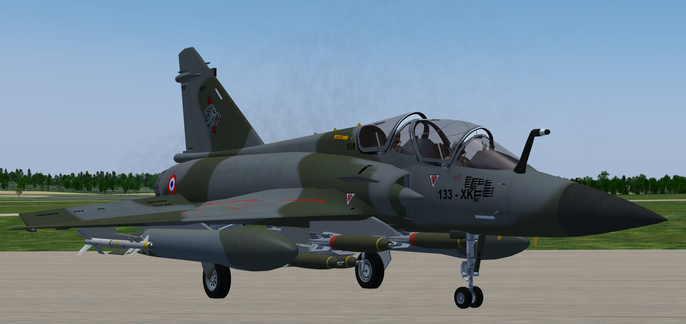

************************************
FlightGear Mirage 2000 Documentation
************************************

Welcome to the documentation of the `Dassault Mirage 2000⇗ <https://en.wikipedia.org/wiki/Dassault_Mirage_2000>`_ for the `FlightGear⇗ <https://www.flightgear.org/>`_ open source flight simulator.

The Mirage 2000 modelled here is mainly the -5F version ("Dash 5"/"tiret cinque"). The bi-place versions 2000D/N and 2000-B are also modelled to some degree (weapons, exterior 3d), but the cockpit remains for the moment the -5 version.

The Mirage 2000 is a multi-role all-weather fighter aircraft from `Dassault Aviation⇗ <https://www.dassault-aviation.com/en/defense/customer-support/operational-aircraft/mirage-2000/>`_. It is one of the best `dogfighters⇗ <https://en.wikipedia.org/wiki/Dogfight>`_ and a far beyond visual range combat aircraft, as well as very capable in air-to-ground strikes.

This Manual
===========

The goal of this manual is to be the most up to date source of information for pilots of this simulation model - in line with recent development of features. As such it documents how the FlightGear Mirage 2000 works - not necessarily how it works in reality!

This manual has been written in order to help you get to know the Mirage 2000 and master flying and fighting with it. The French Delta Knife is not always easy to handle, but we hope the pages in this manual will allow you to become better at fighting with the M2000.

If you find rooms for improvement in this manual, then please contact us (see :ref:`link_chapter_contact`).

Realism
=======

This model in all variants is an interpretation based on publicly available information (see ) without any form of involvement from the manufacturer or any other professional entity with knowledge of (unpublished) material on the original aircraft. Given the lack of authoritative information the realism is by nature limited. Likewise, the goal of the simulation is for pure recreational activity - and therefore the simulation sometimes reduces and sometimes enhances real functionality.

If you have requests for changes / additions, which could further improve the simulation and thereby help to celebrate the Mirage 2000, then please contact us (see :ref:`link_chapter_contact`).

Other Documentation
===================

Apart from this manual, there are other sources of documentation for the FlightGear version:

* The `Mirage 200 wiki page⇗ <https://wiki.flightgear.org/Dassault_Mirage_2000-5>`_ on the official `FlightGear wiki⇗ <https://wiki.flightgear.org/>`_ (not very well maintained).
* The original manual ``Mirage 2000 manual.pdf`` by Renaud "Wolf" Roquefort in `PDF format⇗ <https://en.wikipedia.org/wiki/PDF>`_ in the "Docs" folder. It is the original source of this manual and will eventually be replaced).
* The main and original author of the FlightGear version has published some `5H1N0B1 YouTube videos⇗ <https://www.youtube.com/@5H1N0B1/videos>`_ (a bit aged).
* The excellently modelled FlightGear version of the `F-16⇗ <https://en.wikipedia.org/wiki/General_Dynamics_F-16_Fighting_Falcon>`_ has a very well written `wiki⇗ <https://github.com/NikolaiVChr/f16/wiki>`_, which also explains concepts (e.g. how a radar works).

`RAZBAM⇗ <https://www.razbamsimulationsllc.com/>`_ has made a remarkable simulation of the Mirage 2000C variant for `DCS⇗ <https://www.digitalcombatsimulator.com/en/index.php>`_. There is quite some documentation for it and an active forum, but it is an earlier variant for the Mirage 2000 and therefore has somewhat other capabilities and a distinctively different cockpit.

Credits
=======

* Renaud "Wolf" Roquefort has written the first extensive documentation. This manual is an enhanced copy of it - and the current author would have felt too overwhelming if there would not have been such a great source. The acknowledgements in Wolf's original work are as follows: "I would like to thank everyone who helped me on this project. My first words of thanks go to S. "VooDoo3" Liakos, who gave me the idea of the manual in the first place, and for being a supportive friend. I am not certain this manual would exist without him. I thank I. "Interce" Klimov, 5H1N0B1 and CUDA22 as well for their support during the creation of this manual. Thank you to all who did changes and improvements to this manual, or pointed out things to modify: Legoboyvdlp, Rudolf, CUDA22, Reaper, and 5H1N0B1 himself."

* The authors of the model: Helijah (3D), 5H1N0B1 (Weapons, Systems), Richard Harrison (FDM), Leto, Josh Davidson (FCS/FBW/Autopilot), hardball, Domokos Juttner (Rudolf), F-Sig, J Maverick 16, legoboyvdlp, onox, ravenclaw_007, Niall "Salmon" Roe, Marsdolphin, R. "Wolf" Roquefort, Rick Gruber-Riemer

* The authors of the common weapons and radar systems for `OpRedFlag⇗ <https://github.com/NikolaiVChr/OpRedFlag>`_, on which this model depends and which makes it possible, to use the plane in air and ground attack as part of military simulation in the `OPRF⇗ <https://opredflag.com/>`_ (Open Red Flag) community.

* The authors of the `FlighGear F-16⇗ <https://github.com/NikolaiVChr/f16>`_ are a constant source of inspiration - and the level of sophistication of the model is what the M2000 is aiming for, but maybe never will get on par with.

License
=======

This FlightGear Mirage 2000 model including its documentation is licensed with `GNU GPL⇗ <https://en.wikipedia.org/wiki/GNU_General_Public_License>`_ version 2. See the `licence information⇗ <https://github.com/5H1N0B11/flightgear-mirage2000/blob/master/Mirage-2000/COPYING>`_ in the repo.

.. _link_chapter_contact:

Contact and Contributions
=========================

Please do not hesitate to contact. The more information you provide (not at least links to published pictures, information etc.), the higher the chance that improvements can be made. Doing research and finding plausible details for how to improve the simulation is time consuming and contributions are very welcome by the maintainers. You do not have to be a developer to help with progress.

* The currently most active developer can be reached by e-mail at rick AT vanosten DOT net.

* The `GitHub repo⇗ <https://github.com/5H1N0B11/flightgear-mirage2000>`_ also provides the possibility to submit issues.

* The official `FlightGear Forum⇗ <https://forum.flightgear.org/>`_ has a dedicated `thread for the Mirage 2000⇗ <https://forum.flightgear.org/viewtopic.php?f=4&t=20576>`_.

* There is also a specific `Discord server⇗ <https://discord.gg/ApmtWcUh>`_ dedicated to the development of this simulation.

Conventions Used in this Manual
===============================

A ``⇗`` at the end of a link means that the link points to a site outside of this manual - otherwise to a different area within this manual.
