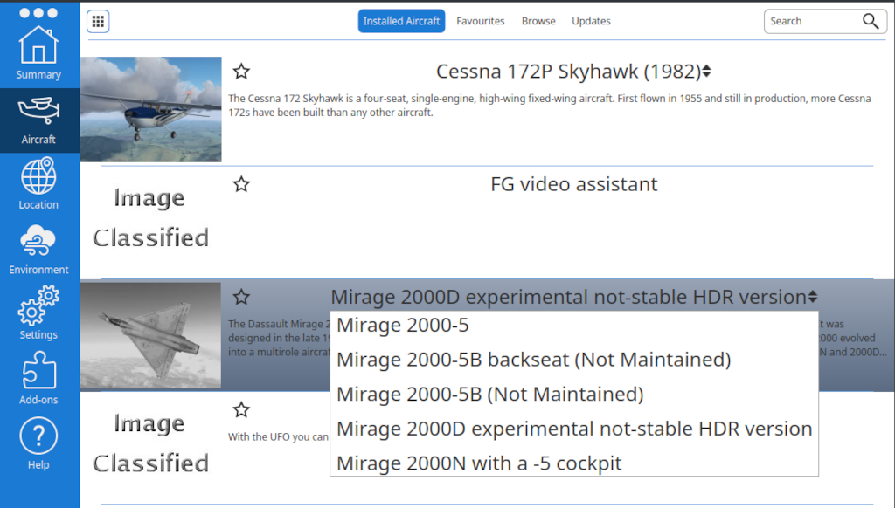

************************************
FlightGear Mirage 2000 Documentation
************************************

Welcome to the documentation of the `Dassault Mirage 2000⇗ <https://en.wikipedia.org/wiki/Dassault_Mirage_2000>`_ for the `FlightGear⇗ <https://www.flightgear.org/>`_ open source flight simulator.

The Mirage 2000 modelled here is mainly the -5 version ("Dash 5"/"tiret cinque"). The bi-place versions 2000D/N are also modelled to some degree (weapons, exterior 3d), but the cockpit remains for the moment the -5 version. There is also a -5B and -5B backseater version, but it is deprecated, not actively tested and might therefore simply not work.

The Mirage 2000 is a French multi-role all-weather fighter aircraft from `Dassault Aviation⇗ <https://www.dassault-aviation.com/en/defense/customer-support/operational-aircraft/mirage-2000/>`_. In the single-seater versions it is one of the best `dogfighters⇗ <https://en.wikipedia.org/wiki/Dogfight>`_ of its generation and a far beyond visual range combat aircraft. The single-seater as well as the specialized double-seater versions are very capable in air-to-ground strikes.

.. image:: images/logo_2000D.png
   :scale: 20%

This Manual
===========

The goal of this manual is to be the most up to date source of information for pilots of this simulation model - in line with recent development of features. As such it documents how the FlightGear Mirage 2000 works - not how it works in reality!

This manual has been written in order to help you get to know the FlightGear Mirage 2000 and master flying and fighting with it. The French Delta Knife is not always easy to handle, but we hope the pages in this manual will allow you to become better at fighting with the modelled Mirage 2000 variants.

If you find rooms for improvement in this manual, then please contact us (see :ref:`link_section_contact`).

The old/original manual ``Mirage 2000 manual.pdf`` by Renaud "Wolf" Roquefort can be found in the "Docs" folder or accessed by `this link <https://github.com/5H1N0B11/flightgear-mirage2000/blob/master/Mirage-2000/Docs/mirage2000-old-manual.pdf>`_. It is one of the sources of this manual and will eventually be replaced. However, it still contains information, which has not yet been migrated (e.g. engine and fuel systems, presentation of cockpit instruments, air-2-air interception procedures and combat, navigation, autopilot). When there is overlapping information, then most probably this manual is better aligned with the current version of the model in FlightGear.

Realism
=======

Disclaimer
----------

This model in all variants is an interpretation of the real Mirage 2000 based on publicly available information (see :ref:`link_chapter_references`) without any form of involvement from the original equipment manufacturer or any other entity with knowledge of unpublished/classified material of the original aircraft or its offensive/defensive systems.

Given the lack of authoritative information on military sensitive information, the realism of this model is by nature limited. Likewise, the goal of the simulation is for pure recreational activity - and therefore the simulation sometimes deliberately reduces and other times enhances real functionality/procedures to make the model more accessible to the casual simulation pilot. A lot of functionality / characteristics are "could-be" guesses good enough for gameplay purposes.

These remarks are especially relevant for the simulation of weapons/countermeasures/damage, which - apart from the natural lack of detailed documentation - are modelled as an opt-in to the FlightGear flight simulator and lack fidelity compared to reality. The fidelity and accuracy try to mimic what "could-be" real, but in the end just try to allow some recreational but still "realistic" game-play.

As such this manual and the FlightGear model are merely free (as in beer) spare-time personal projects for entertainment in the FlightGear open source simulation community. This manual cannot be used to learn how to handle the systems of or to fly real Mirage 2000 variants.

Priorities
----------

The priorities for modelling the Mirage 2000 in FlightGear are currently roughly as follows:

* Cockpit 3D modelling over exterior 3D modelling over weapons 3D modelling
* Digital displays over conventional instruments over switches
* Front seat over backseat
* M2000-5 over M2000N/D
* Compatibility with the latest stable FlightGear version (e.g. 2024.1.* as per year 2025) over backwards compatibility

Country variants
----------------

Currently there is no explicit modelling of export variants - neither in terms of 3D, specific weapons or systems, labelling of the cockpit etc. However, a larger set of liveries covering many countries and squadrons can be chosen.

Enhancements
------------

If you have requests for changes / additions, which could further improve the simulation and thereby help to celebrate the Mirage 2000, then please contact us (see :ref:`link_section_contact`).

Other Documentation
===================

Apart from this manual, there are other sources of documentation for the FlightGear version:

* The `Mirage 200 wiki page⇗ <https://wiki.flightgear.org/Dassault_Mirage_2000-5>`_ on the official `FlightGear wiki⇗ <https://wiki.flightgear.org/>`_ (not very well maintained).
* The main and original author of the FlightGear version has published some `5H1N0B1 YouTube videos⇗ <https://www.youtube.com/@5H1N0B1/videos>`_ (a bit aged).
* The excellently modelled FlightGear version of the `F-16⇗ <https://en.wikipedia.org/wiki/General_Dynamics_F-16_Fighting_Falcon>`_ has a very well written `wiki⇗ <https://github.com/NikolaiVChr/f16/wiki>`_, which also explains concepts (e.g. how a radar works).

`RAZBAM⇗ <https://www.razbamsimulationsllc.com/>`_ has made a remarkable simulation of the Mirage 2000C variant for `DCS⇗ <https://www.digitalcombatsimulator.com/en/index.php>`_. There is quite some documentation for it and an active forum, but it is an earlier variant for the Mirage 2000 (C) and therefore has somewhat other capabilities and a distinctively different cockpit.

Credits
=======

* The authors of the model: Helijah (3D), 5H1N0B1 (Weapons, Systems), Richard Harrison (FDM), Leto, Josh Davidson (FCS/FBW/Autopilot), hardball, Domokos Juttner (Rudolf), F-Sig, J Maverick 16, legoboyvdlp, onox, ravenclaw_007, Niall "Salmon" Roe, Marsdolphin, R. "Wolf" Roquefort, Rick Gruber-Riemer

* The authors of the common weapons and radar systems for `OpRedFlag⇗ <https://github.com/Op-RedFlag/OpRedFlag>`_, on which this model depends and which makes it possible, to use the plane in air and ground attack as part of military simulation in the `OPRF⇗ <https://opredflag.com/>`_ (Open Red Flag) community.

* The authors of the `FlightGear F-16⇗ <https://github.com/NikolaiVChr/f16>`_ are a constant source of inspiration - and the level of sophistication of the model is what the M2000 is aiming for, but maybe never will get on par with.

* Helping hands for the creation of the manual: 5H1N0B1, CUDA22, I. "Interce" Klimov, SammySkycrafts, VooDoo3, Legoboyvdlp, Rudolf, Reaper

License
=======

This FlightGear Mirage 2000 model including its documentation is licensed with `GNU GPL⇗ <https://en.wikipedia.org/wiki/GNU_General_Public_License>`_ version 2. See the `licence information⇗ <https://github.com/5H1N0B11/flightgear-mirage2000/blob/master/Mirage-2000/COPYING>`_ in the repo.

.. _link_section_contact:

Contact and Contributions
=========================

Please do not hesitate to contact. The more information you provide (not at least links to published pictures, information etc.), the higher the chance that improvements can be made. Doing research and finding plausible details for how to improve the simulation is time consuming and contributions are very welcome by the maintainers of this model. You do not have to be a developer to help with progress!

* The currently most active developer can be reached by e-mail at rick AT vanosten DOT net.
* The `GitHub repo⇗ <https://github.com/5H1N0B11/flightgear-mirage2000>`_ provides the possibility to submit issues.
* The official `FlightGear Forum⇗ <https://forum.flightgear.org/>`_ has a dedicated `thread for the Mirage 2000⇗ <https://forum.flightgear.org/viewtopic.php?f=4&t=20576>`_.
* There is also a specific `Discord server⇗ <https://discord.gg/ApmtWcUh>`_ dedicated to the development of this simulation.

Conventions Used in this Manual
===============================

A ``"⇗"`` at the end of a link means that the link points to a site outside of this manual - otherwise to a different area within this manual.

A reference to a specific asset in :ref:`link_chapter_references` is shown as ``[ref: D01]``, where "D01" relates to the unique identifier in front of the reference's title.

****************************************
Presentation of the Mirage 2000 Aircraft
****************************************

Apart from restricted military information: the Mirage 2000 with all its variants is very well documented in books, articles and videos. Therefore, the Mirage 2000's history, technical characteristics etc. is not repeated here. Please use some of the resources listed in :ref:`link_chapter_references` instead.

*************************
Choosing a Variant to Fly
*************************

There is a set of variants to choose from in the FlightGear Launcher as shown in the picture:

Stable versions working in FlightGear version 2024.1:

* ``2000-5``: the single seater fighter variant with 5 displays
* ``2000N``: the double-seater strike variant with ground-attack weapons (it does re-use the -5 cockpit and the backseat is not usable)

Not maintained versions which might work in FlightGear version 2024.1:

* ``2000-5B``: the trainer version for the -5 variant
* ``2000-5B backseat``: sit in the backseat of the -5B over FlightGear multiplayer

Experimental versions only working with the next/development version of FlightGear - not stable/no promises:

* ``2000D``: the double-seater strike variant with ground-attack weapons (it is getting its own cockpit - at least in the front)

