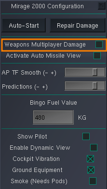
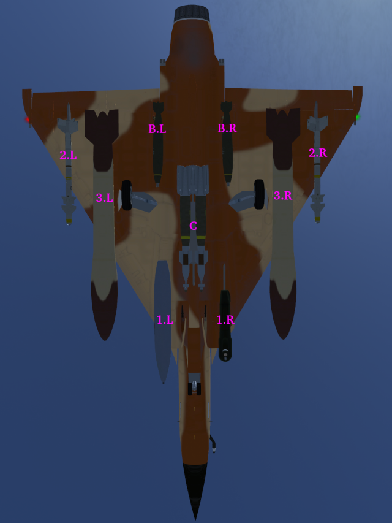
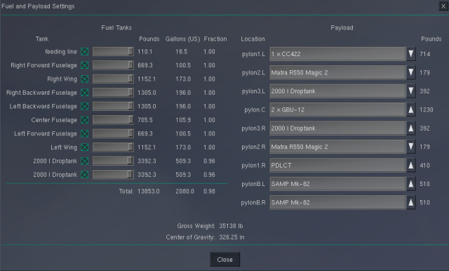
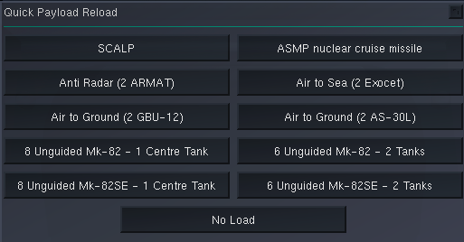
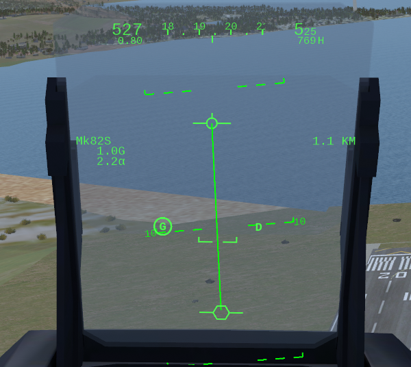
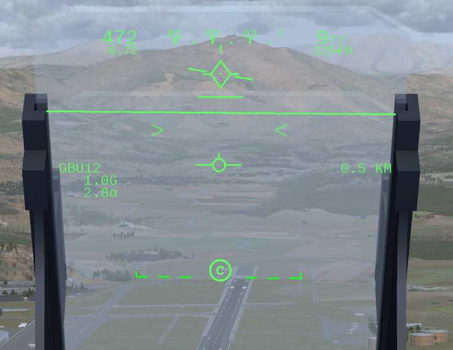
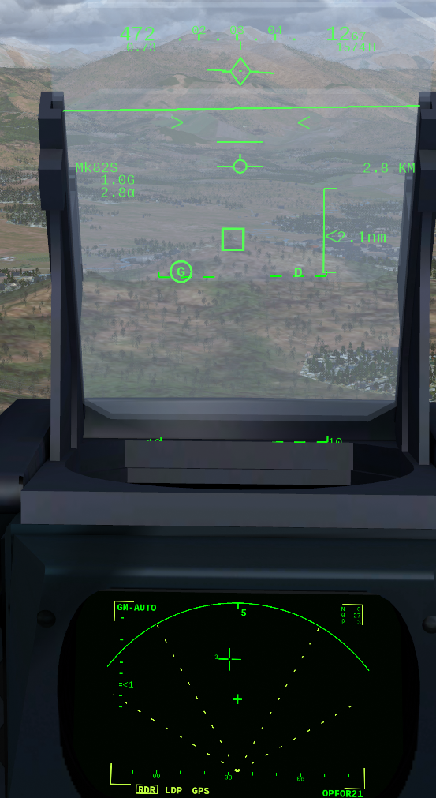
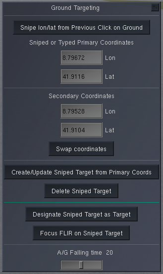

********************
Weapons and Armament
********************

MP Damage
=========

You can only damage other aircraft or MP enabled assets if (a) you have MP damage on and (b) MP damage is on in the target!

To enable or disable MP damage you have to be on the ground and use the configuration through menu item ``Mirage 2000 -> Configuration``.

When damage is on, some features are enabled/disabled automatically to make aerial combat more realistic:

* Backout/redout is enabled
* Simulation rate is set to normal
* Emergency altitude increase is disabled
* Fuel and payload dialogue will not be available in air
* Mission Preplanning dialogue will not be available in air
* Map traffic is disabled
* MP pilot list is disabled

..
   these features are defined in function code_ct in damage.nas

Adding/Removing Weapons
=======================

There are 9 weapon stations. The numbering of weapon stations is as follows:

These numbers are related to the stations represented in the standard FlightGear ``Fuel and Payload Settings Screen`` (in menu ``Equipment``). Depending on the chosen Mirage 2000 variant, different weapons can be chosen on different stations. Apart from the available weapons per station no additional restrictions are imposed w.r.t. the combination of weapons. Pictures of real aircraft show that quite some variance is in action. However, it of course makes sense to e.g. have a pod installed if you need laser guidance - or that the weights on both sides of the fuselage are in balance.

To make loading weapons easier, a set of typical loads for a given variant is available in menu item ``Mirage 2000 -> Payload Selection``:

NB: you cannot change weapons when MP Damage is on!

Selecting and Configuring the Active Weapon
===========================================

The active weapon is selected using ``Key: w`` to cycle through the available mounted weapons. The stores management system (see :ref:`link_subsection_sms`) shows the available and active weapons. Depending on the active weapon some configurations can be done through the weapons configuration panel (see :ref:`link_subsection_ppa`).

Ground Attack
=============

Basic Keys
----------

* ``Key: m``: toggle master arm
* ``Key: w``: cycle through weapons
* ``Key: ctrl-w``: toggle between CCIP and CCRP
* ``Key: M``: cycle through weapon guidance modes (e.g. LDP for laser guided ammunition)
* ``Key: ctrl-l`` (small L): Fast snipe and designate clicked target for laser

Aiming Modes
------------

CCIP
^^^^

A Constantly Computed Impact Point (CCIP) is in the Mirage shown as a line from the flight path indicator (top) to the impact point (bottom). When the impact point is just above the target, then you release the bomb(s). This shot will not have a good accuracy, because the airplane is slightly banked to the right - for a good shot the airplane should be horizontal.

If you use a standard `Mk82 bomb <https://en.wikipedia.org/wiki/Mark_82_bomb>`_, then you need to start a steep dive (ca. 40 degs) from at least 10'000 ft above the target to have enough time for aiming and for the bomb to get armed. Using the Snake-Eye retarding device (Mk82SE) you can fly pretty low without a deep dive - given enough speed.

CCRP
^^^^

The Constantly Computed Release Point (CCRP) requires a target to have been designated - either with the cursor in ground attack radar mode or using a laser or GPS coordinates.

The following picture shows CCRP guidance for a laser guided GBU12 bomb a few seconds before the ideal release point. The diamond at the top shows with its wings that the pilot should navigate the airplane a bit to the right. The short horizontal line below the diamond moves up from below the closer the release point is. On the right hand side the distance to the release point (not to the target) is shown.

The next picture shows a similar situation, but this time the weapon is a dumb free-fall bomb and the target has been designated using the ground radar.

Laser or GPS Designation
^^^^^^^^^^^^^^^^^^^^^^^^

In the ``Mirage 2000`` menu there is a menu point ``Ground Targeting``, which will display the following dialogue:

It is important to do all steps sequentially!

You can acquire coordinates in two ways: either write the lon and lat directly into the fields - or click on the ground where you want to pick the coordinate and then press the top button (it will be disabled if no laser designation pod has been added to the airplane).

Always the primary coordinates will be used to create/update targets, but a secondary pair can be input as well. A button can swap the primary and secondary coordinates.

A sniped target (simulating what would be done with a laser) can be created with a button based on the primary coordinates. NB: the view can temporarily be changed automatically, such that the coordinate including its elevation above sea level can be fetched behind the scenes).

The target can then be designated using another button.

Alternatively, using ``Key: ctrl-l`` you can fast snipe and designate the clicked target for laser.

A FLIR view (``Key: F6``) can be activated and the button ``Focus FLIR on Sniped Target`` will then point the laser to the sniped coordinates. Thereby the coordinate can be improved by clicking exactly on the target through the FLIR and then updating the target.

Weapon Specific Stuff
---------------------

MK-82 / MK-82SE and GBU-12/GBU-24
^^^^^^^^^^^^^^^^^^^^^^^^^^^^^^^^^

On the PPA the following settings can be done:

* Change between ``CCIP`` and ``CCRP``.
* The number of bombs to ripple (min = 1, max = 18, 0 is not available). You should not ripple GBU's.
* The distance in metres between rippled bombs (min = 5, 10, 20, 30, ..., max = 200).
* The fuze selector can be set to either ``RET.`` (retardé/delayed fuze), or ``INST.`` (instantaneous fuze) or ``INERT.`` (inertial fuze). However, this is not implemented and will always result in an instantaneous fuze.

NB: you cannot choose to release 2 bombs at once (dual mode).

Cannons and Guns
^^^^^^^^^^^^^^^^

The Mirage uses `DEFA cannons⇗ <https://en.wikipedia.org/wiki/DEFA_cannon>`_. It is assumed:

* DEFA 554 for the single-seat Mirage 2000-5: the rate of fire can be changed between states 1800/min (0.033) or 1200/min (0.05) using the PPA
* DEFA 553 in the CC442 gun pod for the Mirage 2000D has a constant rate of fire of 1300/min (0.046).
