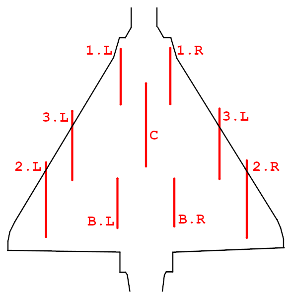
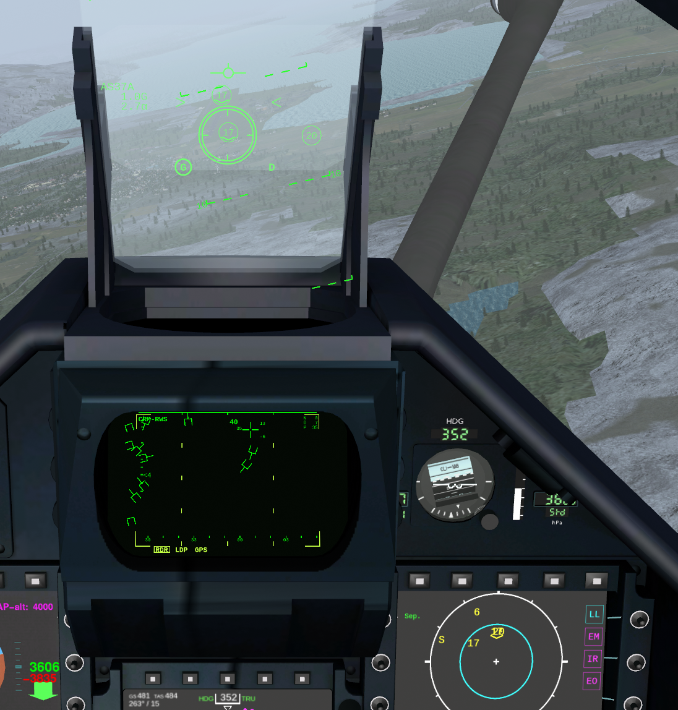

********************
Weapons and Armament
********************

.. _link_section_overview_weapons:

Overview of Available Weapons
=============================

The abbreviation column refers to the abbreviations used in the SMS page (see :ref:`link_subsection_sms`).

..
   The table must be in sync with pylonSetsSMSHelper in pylons.nas

====== =========================================================================================================================
Abbrev Weapon
====== =========================================================================================================================
CAN    30mm Cannon (internal) with `DEFA⇗ <https://en.wikipedia.org/wiki/DEFA_cannon>`_  554
GUN    CC422 (`gun pod⇗ <https://en.wikipedia.org/wiki/Gun_pod>`_) with DEFA 553
MAG    `Matra R550 Magic 2⇗ <https://en.wikipedia.org/wiki/R.550_Magic>`_
SUP    `Matra Super 530D⇗ <https://en.wikipedia.org/wiki/Super_530>`_
IR     `MICA⇗ <https://en.wikipedia.org/wiki/MICA_(missile)>`_ IR
EM     MICA EM
AM39   `AM.39 Exocet⇗ <https://en.wikipedia.org/wiki/Exocet>`_
AS37A  AS-37 Armat (`Martel⇗ <https://en.wikipedia.org/wiki/Martel_(missile)>`_)
AS30L  `AS-30L⇗ <https://en.wikipedia.org/wiki/AS-30>`_
APACH  `APACHE⇗ <https://en.wikipedia.org/wiki/Apache_(missile)>`_
SCALP  `SCALP-EG⇗ <https://en.wikipedia.org/wiki/Storm_Shadow>`_
ASMP   `ASMP-A⇗ <https://en.wikipedia.org/wiki/Air-sol_moyenne_port%C3%A9e>`_
G12    `GBU-12⇗ <https://en.wikipedia.org/wiki/GBU-12_Paveway_II>`_
G24    `GBU-24⇗ <https://en.wikipedia.org/wiki/GBU-24_Paveway_III>`_
BL     SAMP `Mk-82⇗ <https://en.wikipedia.org/wiki/Mark_82_bomb>`_ (FR: bombe lisse)
BF     SAMP Mk-82 Snake Eye (FR: bombe freinée)

RP520  1300 l `drop tank⇗ <https://en.wikipedia.org/wiki/Drop_tank>`_
RP540  2000 l drop tank
RP500  1700 l drop tank
PDLCT  `PDLCT⇗ <https://en.wikipedia.org/wiki/PDLCT>`_ targeting pod (TGP)
SMOKE  Smoke Pod
====== =========================================================================================================================

MP Damage
=========

You can only damage other aircraft or MP enabled assets if (a) you have MP damage on and (b) MP damage is on in the target!

To enable or disable MP damage you have to be on the ground and use the configuration through menu item ``Mirage 2000 -> Configuration``.

When damage is on, some features are enabled/disabled automatically to make aerial combat more realistic:

* Black-out/red-out is enabled
* Simulation rate is set to normal
* Emergency altitude increase is disabled
* Fuel and payload dialogue will not be available in air
* Mission Preplanning dialogue will not be available in air
* Map traffic is disabled
* MP pilot list is disabled

..
   these features are defined in function code_ct in damage.nas

Adding/Removing Weapons
=======================

There are 9 weapon stations. The numbering of weapon stations is as follows:

Depending on the aircraft version and the weapon station, possible weapon systems or external fuel tanks may vary. The available payload for each weapon station is as follows:

=============================== === === === === === === === === ===
Payload                         2.L 3.L B.L 1.L C   1.R B.R 3.R 2.R
=============================== === === === === === === === === ===
RPL-541/542 (2000L fuel tank)       5BD	                    5BD
RPL-501/502 (1700L fuel tank)       5BD	                    5BD
RPL-522 (1300L fuel tank)                       5BD
Matra Super 530D                        5               5
Matra R550 Magic II             5BD                             5BD
MBDA MICA IR                    5B                              5B
MBDA MICA EM                            5B  5B      5B  5B
AS30 Laser                          D                       D
AS37 Armat                          5                       5
AM39 Exocet                         5BD                     5BD
SCALP                                           5BD
APACHE                                          5BD
GBU-12 Paveway II                       D   D       D   D
2x GBU-12 Paveway II                            5BD
GBU-24                                          5BD
SAMP Mk-82                              5BD 5BD     5BD 5BD
SAMP Mk-82SE                            5BD 5BD     5BD 5BD
2x SAMP Mk-82                       5BD         5BD         5BD
2x SAMP Mk-82SE                     5BD         5BD         5BD
PDLCT (targeting pod)                               5BD
CC422 (gun pod)                              D
Smoke pod (white)               5BD                             5BD
ASMP-A                                          N
=============================== === === === === === === === === ===

*Key: 5 refers to the 2000-5, B to the 2000-5B, D to the 2000D/N and N to the 2000N.*

Apart from the available weapons per station, the simulation does currently not impose additional restrictions w.r.t. the combination of weapons. Pictures of real aircraft show that quite some variance is in action. However, it of course makes sense to e.g. have a pod installed if you need laser guidance - or that the weights on both sides of the fuselage are in balance. And the real Mirage can only carry one type of graound attack weapon at a time (e.g. not SAMP Mk-82 and SAMP MK-82SE at the same time).

To make loading weapons easier, a set of typical loads for a given variant is available in menu item ``Mirage 2000 -> Payload Selection``. Using either of them will also replenish the DEFA cannon as well as the onboard chaffs and flares.

NB: you cannot change your payload when MP Damage is on and your aircraft is moving!

Basic Keys
==========

* ``Key: m``: toggle master arm
* ``Key: w``: cycle through weapons - also used to get into flight mode ``Attack``
* ``Key: e``: weapons trigger for guns, missiles and bombs
* ``Key: M``: cycle through weapon guidance modes (e.g. LDP for laser guided ammunition)
* ``Key: ctrl-l`` (small L): Fast snipe and designate clicked target for laser

Configuring the Active Weapon
=============================

The stores management system (see :ref:`link_subsection_sms`) shows the available and active weapons. Depending on the active weapon some configurations can be done through the weapons configuration panel (see :ref:`link_subsection_ppa`).

Shooting
========

Make sure that the master arm is on. The HUD displays the diverse reticles in ``Attack`` mode also if master arm is off. If the master arm is off, then the weapon mode on the left side of the HUD is flashing.

Use the trigger (``Key: e``) for releasing a weapon no matter the type.

Ground Attack
=============

Aiming Modes
------------

CCIP
^^^^

A Constantly Computed Impact Point (CCIP) is in the Mirage shown as a line from the flight path indicator (top) to the impact point (bottom). When the impact point is just above the target, then you release the bomb(s).

The release in the image below will not have a good accuracy, because the airplane is slightly banked to the right - for a good shot the airplane should be horizontal.

.. image:: images/ground_attack_ccip_hud.png

NB: CCIP is not available for the standard `Mk82 bomb <https://en.wikipedia.org/wiki/Mark_82_bomb>`_ - for those you need to use CCRP.

CCRP
^^^^

The Constantly Computed Release Point (CCRP) requires a target to have been designated - either with the cursor in ground attack radar mode or using a laser or GPS coordinates.

The following picture shows CCRP guidance for a laser guided GBU12 bomb a few seconds before the ideal release point. The diamond at the top shows with its wings that the pilot should navigate the airplane a bit to the right. The short horizontal line below the diamond moves up from below the closer the release point is. On the right hand side the distance to the release point (not to the target) is shown.

.. image:: images/ground_attack_ccrp_hud_laser_guided.png

The next picture shows a similar situation, but this time the weapon is a dumb free-fall bomb and the target has been designated using the ground radar.

.. image:: images/ground_attack_ccrp_hud_designated.png
   :scale: 50%

.. _link_subsection_designation:

Laser or GPS Designation
^^^^^^^^^^^^^^^^^^^^^^^^

In the ``Mirage 2000`` menu there is a menu point ``Ground Targeting``, which will display the following dialogue:

.. image:: images/ground_attack_targeting_dialogue.png
   :scale: 50%

It is important to do all steps sequentially!

You can acquire coordinates in two ways: either write the lon and lat directly into the fields - or click on the ground where you want to pick the coordinate and then press the top button (it will be disabled if no laser designation pod has been added to the airplane).

Always the primary coordinates will be used to create/update targets, but a secondary pair can be input as well. A button can swap the primary and secondary coordinates.

A sniped target (simulating what would be done with a laser) can be created with a button based on the primary coordinates. NB: the view can temporarily be changed automatically, such that the coordinate including its elevation above sea level can be fetched behind the scenes.

The target can then be designated using another button.

Alternatively, using ``Key: ctrl-l`` you can fast snipe and designate the clicked target for laser.

A FLIR view (``Key: F6``) can be activated and the button ``Focus FLIR on Sniped Target`` will then point the laser to the sniped coordinates. Thereby the coordinate can be improved by clicking exactly on the target through the FLIR and then updating the target.

MK-82 / MK-82SE and GBU-12/GBU-24
---------------------------------

On the PPA the following settings can be done:

* Change between ``CCIP`` and ``CCRP``.
* The number of bombs to ripple (min = 1, max = 18, 0 is not available). You should not ripple GBU's.
* The distance in metres between rippled bombs (min = 5, 10, 20, 30, ..., max = 200).
* The fuze selector can be set to either ``RET.`` (retardé/delayed fuze), or ``INST.`` (instantaneous fuze) or ``INERT.`` (inertial fuze). However, this is not implemented and will always result in an instantaneous fuze.

NB: you cannot choose to release 2 bombs at once (dual mode).

For the GBUs a laser target has to be designated (see :ref:`link_subsection_designation`), the weapons guidance mode must be ``LDP`` and airspeed at least 350 kt.

AS-30L(Laser)
-------------

The missile needs to be fired:

* below 32'800 ft
* below 5 g
* below mach 0.9
* below 45 degs of roll
* within 9.7 nm (18 km) of the target
* with a designated target and weapons guidance mode in ``LDP``
* powered on
* the airplane nose must point within 16 degrees to the target, because the seeker field is only 32 degrees

For the designation of a laser target see :ref:`link_subsection_designation`. Once the missile has been launched, then the plane can turn away, because the target designation pod can illuminate by turning the laser pointer.

Cannons and Guns
----------------

The Mirage uses `DEFA cannons⇗ <https://en.wikipedia.org/wiki/DEFA_cannon>`_:

* DEFA 554 for the single-seat Mirage 2000-5: the rate of fire can be changed to either ``High`` = 1800/min (0.033) or ``Low`` = 1200/min (0.05) using the PPA.
* DEFA 553 in the CC442 gun pod for the Mirage 2000D has a constant rate of fire of 1300/min (0.046).

In the PPA the gun mode can be set to either air-to-air or air-to-ground ("cannon air-sol").

.. image:: images/ppa_cannon.png
   :scale: 50%

On the lower left of the PPA the symbology for shoot incitation in the HUD for air-to-air can be toggled between two modes:

* CCLT (Calcul continu de la ligne de tir): tracer line (no radar needed)
* PRED (Prédictif): shoot incitation symbology is displayed if there is a radar lock and the geometry between the aircraft and the target allows it.

For air-to-air the wingspan of the expected target can be set between 7 and 40 metres using the switch on the lower right side (press up = +1 metre, press down = +5 metres). This influences the 600 m and 300 m markers on the tracer line in the HUD. In the picture below a plane with a wingspan over 40 metres is ca. 550 metres away and therefore a bit wider than the lower 600 m line and smaller than the 300 m line above.

.. image:: images/tracer_wingspan.png
   :scale: 50%

AS-37 Armat (Anti-Radiation)
----------------------------

There is very little information available for the AS-37 Armat ("Anti Radiation MArTel") missile - especially how the aiming in the cockpit is done. And there is a lack of officially confirmed information abouts its use on Mirage 2000 variants as well as which countries might have been using it. Most probably requirements for not having to fit the launching aircraft with a lot of specialised equipment for the SEAD (`Suppression of Enemy Air Defenses⇗ <https://en.wikipedia.org/wiki/Suppression_of_enemy_air_defenses>`_) can be fulfilled by the AS-37 (e.g. like stated in "RAAF's requirement under AIR 5398" in ref[A07]). Ref[A07] also states "With its high launch weight, heavyweight warhead and long range, the Armat is primarily an offensive strategic ARM designed to destroy Early Warning and Ground Control Intercept radars." Some sources indicate that the Armat had few (3) different seeker head options that could track only specific radar types. Because this is decided on ground there is limited possibilitiy to chase opportunistic targets and cannot be used for (self) defence.

NB: f you have any information/hints available to make the implementation more realistic, then let the developers know.

Therefore, the implementation is purely fictional and takes inspiration from the DCS AV-8B Harrier AGM 122 Sidearm setup:

* Most probably the missile was only available in the -C version, maybe in the -D/N versions. This is why a rather primitive display system only using the HUD is used - only the -D and -5 versions have displays, which could show a page like in the F-16 or F-18 MFDs.
* The type of radar target has to be set on the ground: ``GROUND`` (GCI, radar towers - radar code ``S`` in OPRF), ``SHIP`` (frigates etc. - ``SH``), larger static ground based SAMS (SA-3 ``3``, SA-75 ``2``, S-200 ``5``, S-300 ``20``, MIM104D ``P``). E.g. smaller ships and self-propelled targets like the Shilka (``AA``), SA-6 (``6``) and Buk-M2 (``17``) cannot be targeted - this is really just a "random" choice for simulation.
* Power for the missile seeker must be explicitly activated.

For aiming you need to combine the RWR display (see :ref:`link_subsection_rwr`) with information in the HUD:

* The HUD only displays a narrow field of view and filters on surface or naval assets which have an air radar. Unknown target types will not be displayed. A mximum of 8 threats are displayed (more severe threats are prioritised).
* The HUD is based on the passive radar homing detection capabilities of the missile, which has been chosen to be 50 nm (the max range of the missile is 54 nm) - which is much lower than the RWR capabilities.
* Therefore, you can use the RWR to spot potential targets and then steer the airplane into that direction until the target is displayed on the HUD (unless it is airborne or out of range). Remember that the distance from the centre in the RWR is not an indication of distance!

In the HUD all detected radiation emitters within the HUD field for view are displayed without any range information using the same type information as in the RWR. E.g. on the following screenshot you can see three radiation targets in the HUD - the same as shown in the RWR (where they overlap). The recticle is always in the centre and gets a double circle, when there is a lock. As with IR-missiles you will hear low and high volume sounds to indicate whether a lock has been acquired.

The missile needs to be fired:

* below 38'000 ft
* below 5 g
* below mach 0.9
* below 45 degs of roll
* within 50 nm of the target (more realistically below 35 nm if you launch it from pop-up)

Tips:

* Once a lock is acquired the recticle does not have to be kept directly over the target. However, if the recticle is moved too far away before the missile is shot, then the lock will get broken.
* The missile flies directly towards the target. If you launch too shallow, then it might hit the ground.
* After the first missile has been fired, the second missile's power must be activated in the PPA.

AM39 Exocet (Anti Ship)
-----------------------

The missile needs to be fired:

* below 30'000 ft
* below 5 g
* below mach 0.9
* below 45 degs of roll
* within 38 nm of the target
* flying level and not below 250 ft (the missile motor starts frist after a drop time of 2 seconds and needs some time to accelerate the missile to stable flight)
* with a target selected in SEA radar mode

Tips:

* Power for the missile must be explicitly activated - also before you want to fire a second missile.
